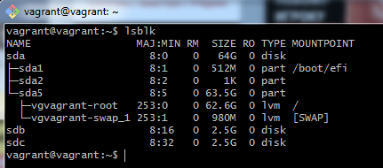
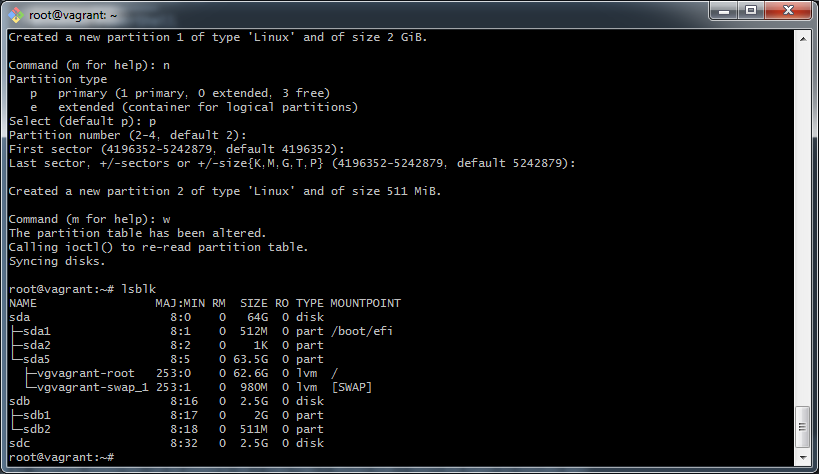
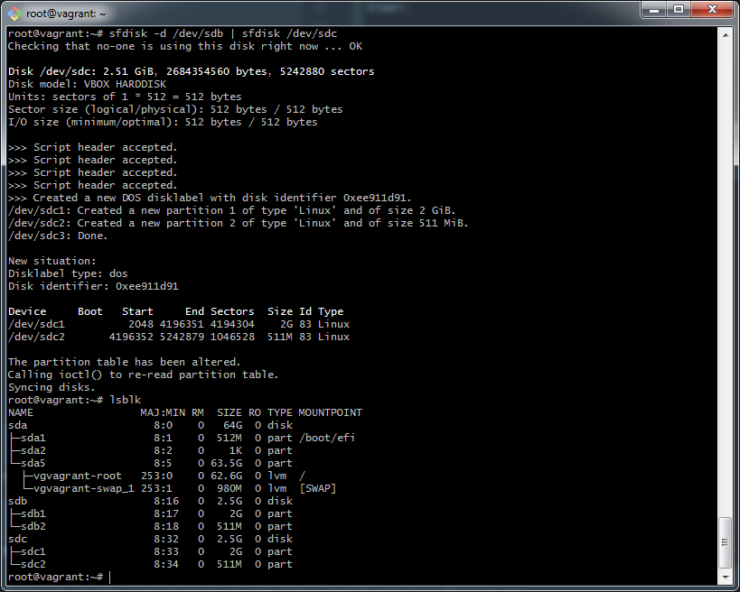
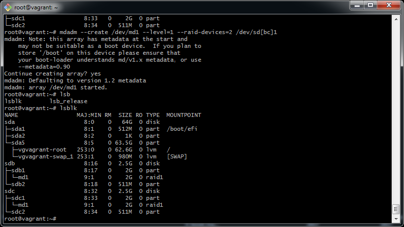
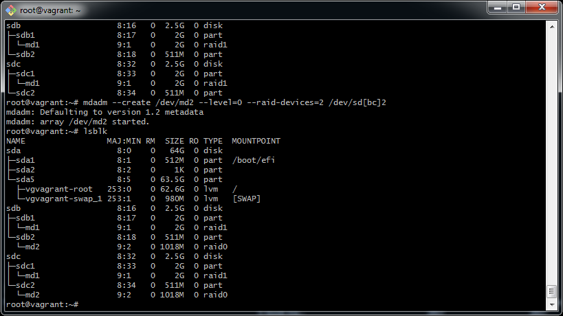
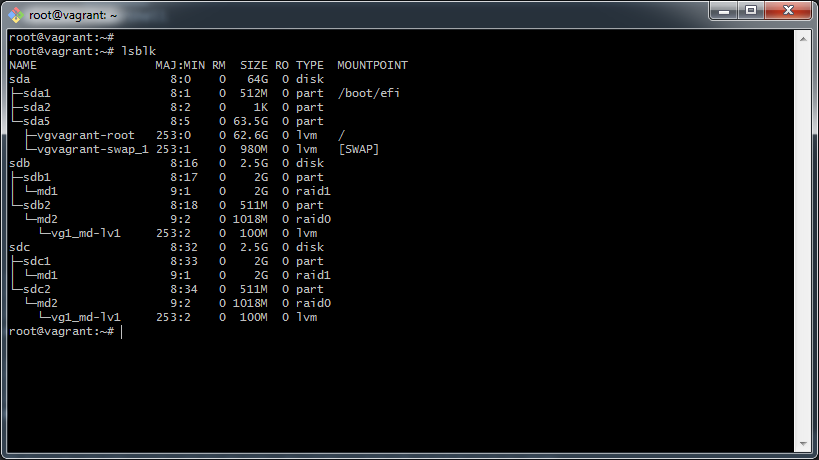
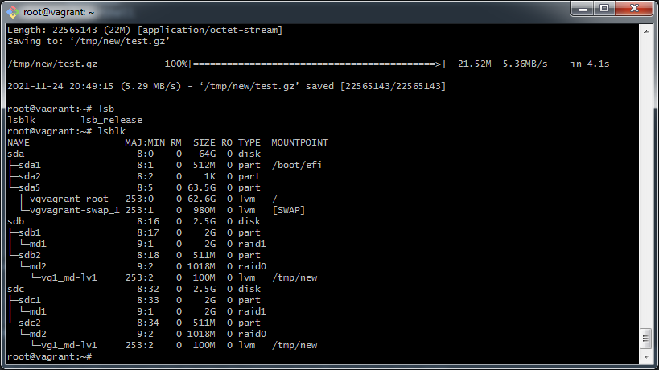
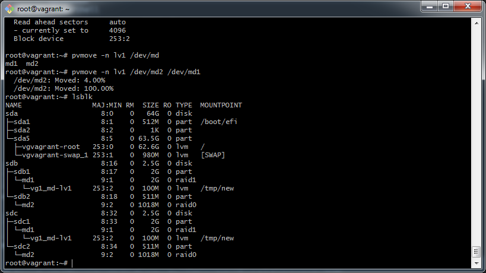
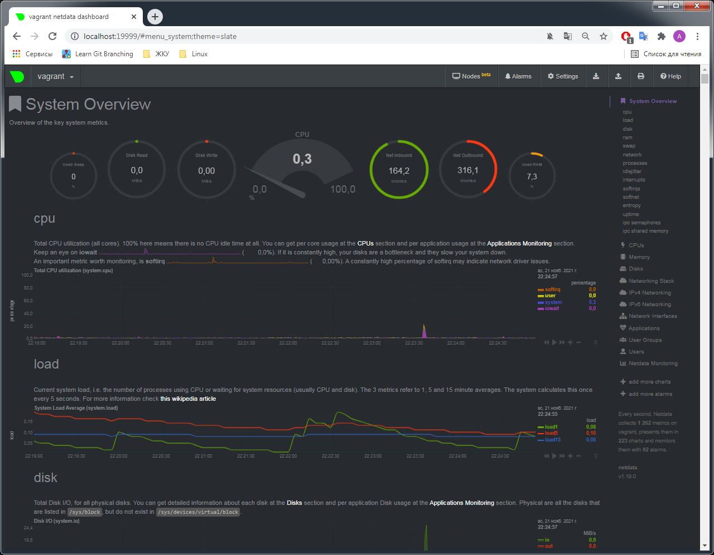

# DevOps-netology - учебный курс для DevOps инженеров

Это публичный репозиторий, созданный для обучения и отработки навыков.
Если вы DevOps специалист, то полезной информации для вас тут нет.

Здесь будут опубликованы некоторые ДЗ по курсу.
Github - простой и удобный способ доставки решения до преподавателя.

## Задание - 3.6 Компьютерные сети

> 1. Работа c HTTP через телнет. Подключитесь утилитой телнет к сайту stackoverflow.com telnet stackoverflow.com 80, отправьте HTTP запрос. В ответе укажите полученный HTTP код, что он означает?

Ответ:
Получил от сервера ответ 302 Moved Temporarily, что означает ресурс переехал, в том числе сервер отдает headers, body в ответе отсутствует или пустой.
```
HTTP/1.0 302 Moved Temporarily
Location: https://151.101.129.69:6081/php/uid.php?vsys=1&rule=2&url=http://151.101.129.69%2fquestions
Content-Length: 0
Pragma: no-cache
Cache-Control: no-cache
```

> 2. Повторите задание 1 в браузере, используя консоль разработчика F12.

Ответ:


Время загрузки страницы составило 343ms, запрос GET https://stackoverflow.com/ обрабатывался дольше всего:


 
> 3. Какой IP адрес у вас в интернете?

Ответ:
Через сайт https://whoer.net/ узнал IP: 80.248.ХХХ.ХХХ

> 4. Какому провайдеру принадлежит ваш IP адрес? Какой автономной системе AS? Воспользуйтесь утилитой whois.

Ответ:
`whois 80.248.XXX.XXX`, провайдер: Rostelecom, AS: AS8997

> 5. Через какие сети проходит пакет, отправленный с вашего компьютера на адрес 8.8.8.8? Через какие AS? Воспользуйтесь утилитой traceroute

Ответ:
```
[sovar@spb-svc ~]$ traceroute -An 8.8.8.8
traceroute to 8.8.8.8 (8.8.8.8), 30 hops max, 60 byte packets
 1  10.ХХХ.ХХХ.ХХХ [*]  1.106 ms  1.407 ms  1.636 ms
 2  192.ХХХ.ХХХ.ХХХ [*]  2.242 ms  2.187 ms  2.135 ms
 3  80.248.ХХХ.ХХХ [AS12380]  4.702 ms  4.649 ms  4.597 ms
 4  212.48.ХХХ.ХХХ [AS12389]  2.566 ms  2.511 ms 212.48.204.190 [AS12389]  3.136 ms
 5  188.254.2.4 [AS12389]  3.090 ms  6.932 ms 188.254.2.6 [AS12389]  7.495 ms
 6  87.226.194.47 [AS12389]  6.766 ms  4.581 ms  5.465 ms
 7  74.125.244.133 [AS15169]  8.124 ms  6.627 ms 74.125.244.181 [AS15169]  7.181 ms
 8  72.14.232.84 [AS15169]  16.508 ms 142.251.61.221 [AS15169]  10.593 ms 72.14.232.84 [AS15169]  7.045 ms
 9  142.250.56.13 [AS15169]  6.964 ms 216.239.63.25 [AS15169]  12.367 ms 216.239.48.163 [AS15169]  11.007 ms
10  172.253.51.239 [AS15169]  12.927 ms * 142.250.56.215 [AS15169]  16.078 ms
11  * * *
12  * * *
13  * * *
14  * * *
15  * * *
16  * * *
17  * * *
18  * * *
19  8.8.8.8 [AS15169]  9.212 ms * *
```

> 6. Повторите задание 5 в утилите mtr. На каком участке наибольшая задержка - delay?

Ответ:
Судя по среднему показателю наибольшие задержки на 9 участке. 
```
 	My traceroute  [v0.94]
spb-svc (10.ХХХ.ХХХ.ХХХ) -> 8.8.8.8 (8.8.8.8)        2021-11-30T10:45:01+0300
Keys:  Help   Display mode   Restart statistics   Order of fields   quit
                                  Packets               Pings
 Host                           Loss%   Snt   Last   Avg  Best  Wrst StDev
 1. AS???    10.ХХХ.ХХХ.ХХХ        0.0%    71    2.3   4.4   1.1  31.7   5.0
 2. AS???    192.ХХХ.ХХХ.ХХХ       0.0%    71    1.0   1.1   0.8   1.5   0.2
 3. AS12380  80.248.ХХХ.ХХХ      0.0%    71    3.4   4.2   1.4  17.0   3.6
 4. AS12389  212.48.ХХХ.ХХХ      0.0%    71    7.1   3.8   1.4  16.4   3.6
 5. AS12389  188.254.2.6         0.0%    71    4.2   4.9   4.0  19.8   2.6
 6. AS12389  87.226.194.47       0.0%    70    8.3   9.0   5.9 163.3  18.8
 7. AS15169  74.125.244.181      0.0%    70    9.6   7.4   6.0  28.0   2.9
 8. AS15169  142.251.51.187      0.0%    70   28.1  12.0   7.7 109.3  13.1
 9. AS15169  172.253.70.51       0.0%    70   12.1  13.5  11.3  57.0   5.6
10. (waiting for reply)
11. (waiting for reply)
12. (waiting for reply)
13. (waiting for reply)
14. (waiting for reply)
15. (waiting for reply)
16. (waiting for reply)
17. (waiting for reply)
18. AS15169  8.8.8.8            95.7%    70    7.6   7.5   7.4   7.6   0.1
```

> 7. Какие DNS сервера отвечают за доменное имя dns.google? Какие A записи? воспользуйтесь утилитой dig

Ответ:
```
dns.google.		3553	IN	NS	ns1.zdns.google.
dns.google.		3553	IN	NS	ns2.zdns.google.
dns.google.		3553	IN	NS	ns3.zdns.google.
dns.google.		3553	IN	NS	ns4.zdns.google.
```
```
dns.google.		256	IN	A	8.8.4.4
dns.google.		256	IN	A	8.8.8.8
```

> 8. Проверьте PTR записи для IP адресов из задания 7. Какое доменное имя привязано к IP? воспользуйтесь утилитой dig

Ответ: 
```
8.8.8.8.in-addr.arpa.	5518	IN	PTR	dns.google.
4.4.8.8.in-addr.arpa.	53671	IN	PTR	dns.google.
```

## Задание - 3.5 Файловые системы

> 1. Узнайте о sparse (разряженных) файлах.

Ответ:
Разреженный файл - файл, в котором последовательность нулевых байтов заменена на информацию об этих последовательностях. По факту можно считать методом сжатия данных на уровне файловой системы. Есть свои преимущества и недостатки.

> 2. Могут ли файлы, являющиеся жесткой ссылкой на один объект, иметь разные права доступа и владельца? Почему?

Ответ:
Нет, не могут. HL (Hard Link) - является идентичными по отношению к объекту, на которые они указывают, inode у них будет один и тот же, в inode записываются метаданные, в том числе и права доступа, поэтому нельзя установить разные права и владельца, в отличии от symlink.

> 3. Сделайте vagrant destroy на имеющийся инстанс Ubuntu. Замените содержимое Vagrantfile. Данная конфигурация создаст новую виртуальную машину с двумя дополнительными неразмеченными дисками по 2.5 Гб.

Ответ: 



> 4. Используя fdisk, разбейте первый диск на 2 раздела: 2 Гб, оставшееся пространство.

Ответ:



> 5. Используя sfdisk, перенесите данную таблицу разделов на второй диск.

Ответ:



> 6. Соберите mdadm RAID1 на паре разделов 2 Гб.

Ответ:



> 7. Соберите mdadm RAID0 на второй паре маленьких разделов. 

Ответ:



> 8. Создайте 2 независимых PV на получившихся md-устройствах.

Ответ:
Создавал через LVM tool, хотя можно было и командами. Общий скрин ниже

> 9. Создайте общую volume-group на этих двух PV.

Ответ:
Создавал через LVM tool, хотя можно было и командами. Общий скрин ниже

> 10. Создайте LV размером 100 Мб, указав его расположение на PV с RAID0.

Ответ:



> 11. Создайте mkfs.ext4 ФС на получившемся LV.

Ответ:
`mkfs.ext4 /dev/vg1_md/lv1`

> 12. Смонтируйте этот раздел в любую директорию, например, /tmp/new.

Ответ:
`mount /dev/vg1_md/lv1 /tmp/new/`. В том числе необходимо добавить данные в /etc/fstab, если есть потребность монтировать LV на постоянную основу. Без внесения данных в /etc/fstab, после ребута LV не будет примонтирован в /tmp/new

> 13. Поместите туда тестовый файл, например wget https://mirror.yandex.ru/ubuntu/ls-lR.gz -O /tmp/new/test.gz.

Ответ:
```
--2021-11-24 20:49:11--  https://mirror.yandex.ru/ubuntu/ls-lR.gz
Resolving mirror.yandex.ru (mirror.yandex.ru)... 213.180.204.183, 2a02:6b8::183
Connecting to mirror.yandex.ru (mirror.yandex.ru)|213.180.204.183|:443... connected.
HTTP request sent, awaiting response... 200 OK
Length: 22565143 (22M) [application/octet-stream]
Saving to: ‘/tmp/new/test.gz’

/tmp/new/test.gz            100%[===========================================>]  21.52M  5.36MB/s    in 4.1s
```

> 14. Прикрепите вывод lsblk.

Ответ:



> 15. Протестируйте целостность файла:

Ответ:
 `md5sum /tmp/new/test.gz`

> 16. Используя pvmove, переместите содержимое PV с RAID0 на RAID1.

Ответ:



> 17. Сделайте --fail на устройство в вашем RAID1 md.

Ответ:
`mdadm /dev/md1 --fail /dev/sdb1`

> 18. Подтвердите выводом dmesg, что RAID1 работает в деградированном состоянии.

Ответ:
```
dmesg | grep md1
[ 8343.259667] md/raid1:md1: Disk failure on sdb1, disabling device.
               md/raid1:md1: Operation continuing on 1 devices.
```

> 19. Протестируйте целостность файла, несмотря на "сбойный" диск он должен продолжать быть доступен:

Ответ:
```
root@vagrant:~# md5sum /tmp/new/test.gz
f12adc4f6c317abad7ae9d8ec49d2ed2  /tmp/new/test.gz
root@vagrant:~# echo $?
0
```

> 20. Погасите тестовый хост, vagrant destroy.

Ответ:
```
sovar@iMACPC MINGW64 /c/DATA/Private/FED/DevOps/course/vagrant
$ vagrant destroy
    default: Are you sure you want to destroy the 'default' VM? [y/N] y
==> default: Forcing shutdown of VM...
==> default: Destroying VM and associated drives...
```

## Задание - 3.4 Операционные системы

> 1. На лекции мы познакомились с node_exporter. В демонстрации его исполняемый файл запускался в background. Этого достаточно для демо, но не для настоящей production-системы, где процессы должны находиться под внешним управлением. Используя знания из лекции по systemd, создайте самостоятельно простой unit-файл для node_exporter.

Ответ:
- `sudo systemctl enable --now node_exporter.service`;
```
[Unit]
Descriotion=Node_Exporter/Prometheus - monitoring host metrics

[Service]
Type=simple
EnvironmentFile=-/etc/default/node_exporter
ExecStart=/home/vagrant/node_exporter-1.3.0.linux-amd64/node_exporter
Restart=always

[Install]
WantedBy=multi-user.target
```
- `systemctl status node_exporter`; через systemctl stop start проверяю работу сервиса, в качестве доп. проверки `curl http://localhost:9100/metrics`
```
vagrant@vagrant:~$ systemctl status node_exporter
● node_exporter.service
     Loaded: loaded (/etc/systemd/system/node_exporter.service; enabled; vendor preset: enabled)
     Active: active (running) since Sun 2021-11-21 18:23:43 UTC; 1s ago
   Main PID: 1061 (node_exporter)
      Tasks: 5 (limit: 2319)
     Memory: 2.5M
     CGroup: /system.slice/node_exporter.service
             └─1061 /home/vagrant/node_exporter-1.3.0.linux-amd64/node_exporter

Nov 21 18:23:43 vagrant node_exporter[1061]: ts=2021-11-21T18:23:43.822Z caller=node_exporter.go:115 level=info collector=thermal_zone
Nov 21 18:23:43 vagrant node_exporter[1061]: ts=2021-11-21T18:23:43.822Z caller=node_exporter.go:115 level=info collector=time
Nov 21 18:23:43 vagrant node_exporter[1061]: ts=2021-11-21T18:23:43.822Z caller=node_exporter.go:115 level=info collector=timex
Nov 21 18:23:43 vagrant node_exporter[1061]: ts=2021-11-21T18:23:43.822Z caller=node_exporter.go:115 level=info collector=udp_queues
Nov 21 18:23:43 vagrant node_exporter[1061]: ts=2021-11-21T18:23:43.822Z caller=node_exporter.go:115 level=info collector=uname
Nov 21 18:23:43 vagrant node_exporter[1061]: ts=2021-11-21T18:23:43.822Z caller=node_exporter.go:115 level=info collector=vmstat
Nov 21 18:23:43 vagrant node_exporter[1061]: ts=2021-11-21T18:23:43.822Z caller=node_exporter.go:115 level=info collector=xfs
Nov 21 18:23:43 vagrant node_exporter[1061]: ts=2021-11-21T18:23:43.822Z caller=node_exporter.go:115 level=info collector=zfs
Nov 21 18:23:43 vagrant node_exporter[1061]: ts=2021-11-21T18:23:43.822Z caller=node_exporter.go:199 level=info msg="Listening on" address=:9100
Nov 21 18:23:43 vagrant node_exporter[1061]: ts=2021-11-21T18:23:43.823Z caller=tls_config.go:195 level=info msg="TLS is disabled." http2=false
```

> 2. Ознакомьтесь с опциями node_exporter и выводом /metrics по-умолчанию. Приведите несколько опций, которые вы бы выбрали для базового мониторинга хоста по CPU, памяти, диску и сети.

Ответ: в рамках отображения метрик на базе графаны есть уже готовый дашборд 1860 by rfraile. Так как разговор идет о мониторинге performence, скорее всего данный сбор аналитики будет достаточным. Однако всегда есть возможность тонкой настройки под себя, к примеру есть следующие метрки:
- CPU: node_cpu_seconds_total - общая загрузка CPU в секунду в разных режимах.
- MEM: go_memstats_alloc_bytes_total - общее кол-во выделенной памяти в байтах
- HDD: node_disk_io_time_seconds_total - общее затраченное время на input|output
- ETH: node_network_up - в up ли сетевой интерфейс

> 3. Установите в свою виртуальную машину Netdata. Воспользуйтесь готовыми пакетами для установки (sudo apt install -y netdata). После успешной перезагрузки в браузере на своем ПК (не в виртуальной машине) вы должны суметь зайти на localhost:19999. Ознакомьтесь с метриками, которые по умолчанию собираются Netdata и с комментариями, которые даны к этим метрикам.

Ответ:



> 4. Можно ли по выводу dmesg понять, осознает ли ОС, что загружена не на настоящем оборудовании, а на системе виртуализации?

Ответ: да, можно
```
[    0.000000] DMI: innotek GmbH VirtualBox/VirtualBox, BIOS VirtualBox 12/01/2006
[    0.000000] Hypervisor detected: KVM
[    0.107494] Booting paravirtualized kernel on KVM
```

> 5. Как настроен sysctl fs.nr_open на системе по-умолчанию? Узнайте, что означает этот параметр. Какой другой существующий лимит не позволит достичь такого числа (ulimit --help)?

Ответ:
fs.nr_open = 1048576. Это означает максимальное количество дескрипторов файлов, которое процесс может выделить, данный лимит зависит от лимита ресурсов RLIMIT_NOFILE. ulimit -Hn определение жесткого лимита.

> 6. Запустите любой долгоживущий процесс (не ls, который отработает мгновенно, а, например, sleep 1h) в отдельном неймспейсе процессов; покажите, что ваш процесс работает под PID 1 через nsenter. Для простоты работайте в данном задании под root (sudo -i). Под обычным пользователем требуются дополнительные опции (--map-root-user) и т.д.

Ответ:
```
root@vagrant:~# unshare -f --pid --mount-proc /usr/bin/sleep 1h

root@vagrant:~# nsenter --target 1708 --pid --mount
root@vagrant:/# ps aux
USER         PID %CPU %MEM    VSZ   RSS TTY      STAT START   TIME COMMAND
root           1  0.0  0.0   8076   532 pts/5    S    20:06   0:00 /usr/bin/sleep 1h
root          12  0.0  0.1   9836  4024 pts/5    S    20:09   0:00 -bash
root          21  0.0  0.1  11492  3356 pts/5    R+   20:09   0:00 ps aux
root@vagrant:/#

```

> 7. Найдите информацию о том, что такое :(){ :|:& };:. Запустите эту команду в своей виртуальной машине Vagrant с Ubuntu 20.04 (это важно, поведение в других ОС не проверялось). Некоторое время все будет "плохо", после чего (минуты) – ОС должна стабилизироваться. Вызов dmesg расскажет, какой механизм помог автоматической стабилизации. Как настроен этот механизм по-умолчанию, и как изменить число процессов, которое можно создать в сессии?

Ответ:
```
: ()
   {
	:|:&
} ; :
```
Функция, которая запускает сама себя два раза, те в свою очередь запускают еще два экземпляра функции и т.д. Чтобы ограничить число процессов необходимо: `ulimit -u n, где n кол-во процессов`. cgroup: fork rejected by pids controller in /user.slice/user-1000.slice/session-7.scope - механизм стабилизации. Группы управления, обычно называемые контрольными группами, представляют собой функцию ядра Linux, которая позволяет организовывать процессы в иерархические группы, использование различных типов ресурсов затем может быть ограничено и отслежено.

## Задание - 3.3 Операционные системы

> 1. Какой системный вызов делает команда cd? В прошлом ДЗ мы выяснили, что cd не является самостоятельной программой, это shell builtin, поэтому запустить strace непосредственно на cd не получится. Тем не менее, вы можете запустить strace на /bin/bash -c 'cd /tmp'. В этом случае вы увидите полный список системных вызовов, которые делает сам bash при старте. Вам нужно найти тот единственный, который относится именно к cd. Обратите внимание, что strace выдаёт результат своей работы в поток stderr, а не в stdout.

Ответ:
`chdir("/tmp")` - системный вызов chdir: изменяет текущий рабочий каталог вызвавшего процесса на каталог, указанный в path.

> 2. Попробуйте использовать команду file на объекты разных типов на файловой системе. Используя strace выясните, где находится база данных file на основании которой она делает свои догадки.

Ответ:
`openat(AT_FDCWD, "/usr/share/misc/magic.mgc", O_RDONLY) = 3`
`/usr/share/misc/magic.mgc` - файл определения типов для команды file. File позволяет определить тип файла посредством проверки соответствия начальных символов файла определенному "магическому" числу (помимо прочих проверок). В файле /usr/share/misc/magic указаны "магические" числа для проверки, сообщение, которое будет выведено в случае обнаружения конкретного "магического" числа, а также дополнительная информация, извлекаемая из файла.

> 3. Предположим, приложение пишет лог в текстовый файл. Этот файл оказался удален (deleted в lsof), однако возможности сигналом сказать приложению переоткрыть файлы или просто перезапустить приложение – нет. Так как приложение продолжает писать в удаленный файл, место на диске постепенно заканчивается. Основываясь на знаниях о перенаправлении потоков предложите способ обнуления открытого удаленного файла (чтобы освободить место на файловой системе).

Ответ:
Через редактор vim открыл файл, swp удалил, получил вот такое состояние `vim  1631 vagrant 3u REG 253,0 12288 131081 /home/vagrant/.test.swp (deleted)`. При помощи команды `echo " " > /proc/1631/fd/3` - результат echo перенаправить в файл /proc/1631/fd/3, тем самым добился уменьшения файла.

> 4. Занимают ли зомби-процессы какие-то ресурсы в ОС (CPU, RAM, IO)?

Ответ:
Зомби процесс - дочерний процесс, который освобождает все ресурсы при завершении работы. Существует пока не обработается сигнал о завершении дочернего процесса родителем.

> 5. В iovisor BCC есть утилита opensnoop. На какие файлы вы увидели вызовы группы open за первую секунду работы утилиты? Воспользуйтесь пакетом bpfcc-tools для Ubuntu 20.04. Дополнительные сведения по установке.

Ответ:
```
PID    COMM               FD ERR PATH
616    irqbalance          6   0 /proc/interrupts
616    irqbalance          6   0 /proc/stat
616    irqbalance          6   0 /proc/irq/20/smp_affinity
616    irqbalance          6   0 /proc/irq/0/smp_affinity
616    irqbalance          6   0 /proc/irq/1/smp_affinity
616    irqbalance          6   0 /proc/irq/8/smp_affinity
616    irqbalance          6   0 /proc/irq/12/smp_affinity
616    irqbalance          6   0 /proc/irq/14/smp_affinity
616    irqbalance          6   0 /proc/irq/15/smp_affinity
```

> 6. Какой системный вызов использует uname -a? Приведите цитату из man по этому системному вызову, где описывается альтернативное местоположение в /proc, где можно узнать версию ядра и релиз ОС.

Ответ:
Системный вызов uname(). 
> Part of the utsname information is also accessible via /proc/sys/kernel/{ostype, hostname, osrelease, version, domainname}.

> 7. Чем отличается последовательность команд через ; и через && в bash? сть ли смысл использовать в bash &&, если применить set -e?

Ответ:
com1 ; com2 - будут выполнится последовательно com1, затем com2.
com1 && com2 - выполнить сначала com1, если успех - код возврата 0, то выполнить com2.
set -e будет перерывать выполнение, если код возврата выполнения команды не 0, в таком случае до com2 дело не дойдет, && смысла не имеет.

> 8. Из каких опций состоит режим bash set -euxo pipefail и почему его хорошо было бы использовать в сценариях?

Ответ: 
Следующие опции отвечают за:
 `-e` - немедленный выход, если программа вернула ненулевой код возарата.
 `-u` - при распарсивании команды неустановленные параметры и команды воспронимаются, как ошибки.
 `-x` - после парсинга команды показывает развернутое значение.
 `-o pipefail` - возвращаемое значение конвейера - это значение последней команды для выхода с ненулевым статусом или ноль, если все команды в конвейере завершаются успешно. По умолчанию эта опция отключена.
При неуспешном выполнении сценария, необбходимо больше информации, что пошло не так, данные параметры помогают нам получить больше информации для отладки.

> 9. Используя -o stat для ps, определите, какой наиболее часто встречающийся статус у процессов в системе. В man ps ознакомьтесь (/PROCESS STATE CODES) что значат дополнительные к основной заглавной буквы статуса процессов. Его можно не учитывать при расчете (считать S, Ss или Ssl равнозначными).

Ответ:
Ss, R+. В данном случае s и + - дополнительные символы. s - лидер сессии, + - находится в группе переднего плана.

## Задание - 3.2 Работа в терминале

> 1. Какого типа команда cd? Попробуйте объяснить, почему она именно такого типа; опишите ход своих мыслей, если считаете что она могла бы быть другого типа.

Ответ:
Команда cd является встроенной. Меняет директорию только в оболочке, в которой выполняется, использует переменные среды, выполняется без порождения дочернего процесса (fork). То есть, если бы команда была не встроена в интерпретатор (внешняя), то тогды бы создавался новый процесс, этот бы процесс наследовал каталог, в котором был создан родительский процесс и само изменение рабочего каталога не выполнялось бы.
 
> 2. Какая альтернатива без pipe команде grep <some_string> <some_file> | wc -l? man grep поможет в ответе на этот вопрос. Ознакомьтесь с документом о других подобных некорректных вариантах использования pipe.

Ответ:
`grep -c lorem test-file`

> 3. Какой процесс с PID 1 является родителем для всех процессов в вашей виртуальной машине Ubuntu 20.04?

Ответ:
systemd `pstree -p`

> 4. Как будет выглядеть команда, которая перенаправит вывод stderr ls на другую сессию терминала?

Ответ:
Команду запускаем в `/dev/pts/0` `ls - 2>/dev/pts/1`

> 5. Получится ли одновременно передать команде файл на stdin и вывести ее stdout в другой файл? Приведите работающий пример.

Ответ: 
`cat < test-file > test-file-stdout`

> 6. Получится ли находясь в графическом режиме, вывести данные из PTY в какой-либо из эмуляторов TTY? Сможете ли вы наблюдать выводимые данные?

Ответ: 
Вывести данные получится необходимо перенаправить stdout, однако наблюдать не получится, необходимо переключится в tty Ctrl-Alt-F1 

> 7. Выполните команду bash 5>&1. К чему она приведет? Что будет, если вы выполните echo netology > /proc/$$/fd/5? Почему так происходит?

Ответ: 
Определение FD 5, перенаправелнеие файлов с указанием FD 5 в stdout. Stdout echo перенаправляет в proc/$$/fd/5, а затем перенаправляется из файла 5 на stdout, тем самым выдается запись netology.

> 8. Получится ли в качестве входного потока для pipe использовать только stderr команды, не потеряв при этом отображение stdout на pty? Напоминаем: по умолчанию через pipe передается только stdout команды слева от | на stdin команды справа. Это можно сделать, поменяв стандартные потоки местами через промежуточный новый дескриптор, который вы научились создавать в предыдущем вопросе.

Ответ:
Да, получится `ls -123 3>&2 2>&1 1>&3 | wc -l`

> 9. Что выведет команда cat /proc/$$/environ? Как еще можно получить аналогичный по содержанию вывод?

Ответ:
Выдает массив значений переменного окружения, наследуются от родительского процесса. Команды printenv, env выводят значение переменного окружения.

> 10. Используя man, опишите что доступно по адресам /proc/<PID>/cmdline, /proc/<PID>/exe.

Ответ:
`/proc/<PID>/cmdline` - RO файл, полная командная строка для процесса, если последний не является зомби. Если процесс зомби, тогда чтение данного файла вернет 0. Аргументы командной строки появляются в этом файле как набор строк, разделенных нулевыми байтами. 
`/proc/<PID>/exe` - символическая ссылка, содержащая фактический путь к исполняемой команде. При попытке открыть файл будет запущен копия процесса. В более ранних версиях Linux (2.0 и младше) - указатель на двоичный файл. Вызов readlink для этого файла возвращает строку в формате [устройство]: индексный дескриптор.

> 11. Узнайте, какую наиболее старшую версию набора инструкций SSE поддерживает ваш процессор с помощью /proc/cpuinfo.

Ответ:
SSE4_2

> 12. При открытии нового окна терминала и vagrant ssh создается новая сессия и выделяется pty. Это можно подтвердить командой tty.....Почитайте, почему так происходит, и как изменить поведение.

Ответ:
При подключении к удаленному компьютеру по ssh tty не выделяется для сеанса по умолчанию, когда же из shell пытаемся запустить ssh, то скорее всего будет далее запущен первым shell и в таком случае tty выделяется, однако ssh ждет передачу user, а в данной команде его нет.
`ssh -t localhost 'tty'` -t принудительное открытие псевдотерминала.

> 13. Бывает, что есть необходимость переместить запущенный процесс из одной сессии в другую. Попробуйте сделать это, воспользовавшись reptyr. Например, так можно перенести в screen процесс, который вы запустили по ошибке в обычной SSH-сессии

Ответ: 
Выполнил. Необходимо установить значение `kernel.yama.ptrace_scope = 0`

> 14. sudo echo string > /root/new_file не даст выполнить перенаправление под обычным пользователем, так как перенаправлением занимается процесс shell'а, который запущен без sudo под вашим пользователем. Для решения данной проблемы можно использовать конструкцию echo string | sudo tee /root/new_file. Узнайте что делает команда tee и почему в отличие от sudo echo команда с sudo tee будет работать.

Ответ:
tee - читает из stdin и пишет stdout, файл. В данном pipeline  вывод в /root/new_file будет как раз выполняться из под sudo.


## Задание - 3.1 работа в терминале 

> 1. Установите средство виртуализации Oracle VirtualBox.

Установил.

> 2. Установите средство автоматизации Hashicorp Vagrant.

Установил.
Ошибок и проблем не наблюдал.

> 3. В вашем основном окружении подготовьте удобный для дальнейшей работы терминал. 

В поиске своего "любимого" терминала.
ДЗ выполняю в MINGW64.

> 4. С помощью базового файла конфигурации запустите Ubuntu 20.04 в VirtualBox посредством Vagrant

Выполнил.
`config.vm.box = "bento/ubuntu-20.04"`
Добавил в списпок to do - разобраться с синтаксисом файла Vagrantfile, изучить доки на оф сайте.

> 5. Ознакомьтесь с графическим интерфейсом VirtualBox, посмотрите как выглядит виртуальная машина, которую создал для вас Vagrant, какие аппаратные ресурсы ей выделены. Какие ресурсы выделены по-умолчанию?

Ответ:
RAM - 1 Gb
CPU - 2
HDD - скорее всего динамический тип, 64 Gb - size, 1,86 Gb - actual size
NET - 1 interface 1Gbit/s, NAT

> 6. Ознакомьтесь с возможностями конфигурации VirtualBox через Vagrantfile: документация. Как добавить оперативной памяти или ресурсов процессора виртуальной машине?

Ответ: 
Добавил 1 Gb RAM, 2 CPU
Для внесения изменений необходимо использовать провайдер VB.

Использовал:
Добавил в файл Vagrantfile:
```
config.vm.provider "virtualbox" do |v|
	v.name = "vagrant_ubuntu_20.04"
	v.memory = 2048
	v.cpus = 4
end
```
> 7. Команда vagrant ssh из директории, в которой содержится Vagrantfile, позволит вам оказаться внутри виртуальной машины без каких-либо дополнительных настроек. Попрактикуйтесь в выполнении обсуждаемых команд в терминале Ubuntu.

Выполнил.

> 8. Ознакомиться с разделами man bash, почитать о настройках самого bash:

- HISTFILESIZE - 681 строка
- не сохранять строки начинающиеся с символа пробел, не сохранять строки, совпадающие с последней выполненной командой

> 9. В каких сценариях использования применимы скобки {} и на какой строчке man bash это описано?

Ответ:
`{}` - зарезервированные слова, могут быть использованы для определения списка, для формирования состовных команд.
151 строка - упоминание о `{ }`, как зарезервированные слова
218 строка - `{ list; }`

> 10. С учётом ответа на предыдущий вопрос, как создать однократным вызовом touch 100000 файлов? Получится ли аналогичным образом создать 300000? Если нет, то почему?

Ответ:
`touch file{0..100000}`
300000 создать аналогично не получится, получим ошибку:
`-bash: /usr/bin/touch: Argument list too long` 
`touch file{0..300000}` будет распарсиваться в `touch file1 file2 file3 ...` строка ввода команды ограничена по размеру аргумента, создание 300000 файлов - в данной команде аргумент выходит за пределы максимальной длинны агрумента.

> 11. В man bash поищите по /\[\[. Что делает конструкция [[ -d /tmp ]]

Ответ:
Проверяет существует ли /tmp и является ли данный файл директорией, если существует и директории тогда возвращает 0.

> 12. Основываясь на знаниях о просмотре текущих (например, PATH) и установке новых переменных; командах, которые мы рассматривали, добейтесь в выводе type -a bash в виртуальной машине наличия первым пунктом в списке

Ответ:
```
mkdir -p /tmp/new_path_directory/bash 
cp /usr/bin/bash /tmp/new_path_directory/bash/
PATH=/tmp/new_path_directory/bash:$PATH
```

> 13. Чем отличается планирование команд с помощью batch и at?

Ответ: 
batch - выполнение команд, когда средняя загрузка системы падает ниже 1,5 или значения, указанного при вызове atd.
at - выполнение команд в указанное время.

## Задание - 2.4 git инструменты

Git содержит достаточно большое количество команд. Выполнение некоторых приводит к одному и тому же результату.

Для отработки навыков, постараюсь получить результат разными командами.

Самое основное, что нужно помнить всегда - все что необходимо уже содержится в man.

> 1. Найдите полный хеш и комментарий коммита, хеш которого начинается на aefea.

Ответ:
aefead2207ef7e2aa5dc81a34aedf0cad4c32545 Update CHANGELOG.md

Использовал:
`git show aefea`;
`git log --pretty=format:"%H , %s" | grep ^aefea`

> 2. Какому тегу соответствует коммит 85024d3?

Ответ:
v0.12.23

Использовал:
`git show 85024d3`;
`git tag --points-at 85024d3` 

> 3. Сколько родителей у коммита b8d720? Напишите их хеши.

Ответ:
- Par1: 56cd7859e05c36c06b56d013b55a252d0bb7e158
- Par2: 9ea88f22fc6269854151c571162c5bcf958bee2b

Использовал:
`git show b8d720^`;
`git show b8d720^2`

> 4. Перечислите хеши и комментарии всех коммитов которые были сделаны между тегами v0.12.23 и v0.12.24.

Ответ:
- b14b74c4939dcab573326f4e3ee2a62e23e12f89 [Website] vmc provider links
- 3f235065b9347a758efadc92295b540ee0a5e26e Update CHANGELOG.md
- 6ae64e247b332925b872447e9ce869657281c2bf registry: Fix panic when server is unreachable
- 5c619ca1baf2e21a155fcdb4c264cc9e24a2a353 website: Remove links to the getting started guide's old location
- 06275647e2b53d97d4f0a19a0fec11f6d69820b5 Update CHANGELOG.md
- d5f9411f5108260320064349b757f55c09bc4b80 command: Fix bug when using terraform login on Windows
- 4b6d06cc5dcb78af637bbb19c198faff37a066ed Update CHANGELOG.md
- dd01a35078f040ca984cdd349f18d0b67e486c35 Update CHANGELOG.md
- 225466bc3e5f35baa5d07197bbc079345b77525e Cleanup after v0.12.23 release

Использовал:
`git log v0.12.24...v0.12.23 --pretty=oneline`

> 5. Найдите коммит в котором была создана функция func providerSource, ее определение в коде выглядит так func providerSource(...) (вместо троеточего перечислены аргументы).

Ответ:
8c928e83589d90a031f811fae52a81be7153e82f

Использовал:
`git log -S "func providerSource("`

> 6. Найдите все коммиты в которых была изменена функция globalPluginDirs.

Ответ:
- 78b12205587fe839f10d946ea3fdc06719decb05
- 52dbf94834cb970b510f2fba853a5b49ad9b1a46
- 41ab0aef7a0fe030e84018973a64135b11abcd70
- 66ebff90cdfaa6938f26f908c7ebad8d547fea17

Использовал:
`git grep -e "globalPluginDirs("` - поиск файла где функция создается;
`git log -L :globalPluginDirs:plugins.go` поиск коммитов, в которых вносятся изменения в функцию.

> 7. Кто автор функции synchronizedWriters?

Ответ:
Martin Atkins <mart@degeneration.co.uk>

Использовал:
`git log -S "synchronizedWriters("` - поиск коммита, где создается функция;
`git show 5ac311e2a91e381e2f52234668b49ba670aa0fe5` - просмот информации о коммите.

## Задание - объяснить наполнение файла  .gitignore

```
**/.terraform/* - игнорирование всего, что лежит в директории /.terraform/, которая может находится где угодно

*.tfstate - игнорирование файлов,которые заканчиваются на .tfstate
*.tfstate.* - игнорирование файлов,которые содержат .tfstate.

crash.log - игнорирование файла crash.log

*.tfvars - игнорирование файлов,которые заканчиваются на *.tfvars

override.tf
override.tf.json
- игнорирование override.tf, override.tf.json

*_override.tf
*_override.tf.json
- игнорирование файлов,которые заканчиваются на _override.tf, _override.tf.json

.terraformrc
terraform.rc
- игнорирование файлов .terraformrc, terraform.rc
```

## Задание - добавить первую строку в README.MD

Привет МИР!
