# DevOps-netology - учебный курс для DevOps инженеров

Это публичный репозиторий, созданный для обучения и отработки навыков.
Если вы DevOps специалист, то полезной информации для вас тут нет.

Здесь будут опубликованы некоторые ДЗ по курсу.
Github - простой и удобный способ доставки решения до преподавателя.

## Задание - 6.5. Elasticsearch

> 1. Используя докер образ centos:7 как базовый и документацию по установке и запуску Elastcisearch:
составьте Dockerfile-манифест для elasticsearch;
соберите docker-образ и сделайте push в ваш docker.io репозиторий;
запустите контейнер из получившегося образа и выполните запрос пути / c хост-машины;
Требования к elasticsearch.yml:
данные path должны сохраняться в /var/lib;
имя ноды должно быть netology_test;
В ответе приведите:
текст Dockerfile манифеста
ссылку на образ в репозитории dockerhub
ответ elasticsearch на запрос пути / в json виде

Ответ:

Dockerfile:
```
FROM centos:centos7

RUN yum -y install wget; yum clean all && \
        groupadd --gid 1000 elasticsearch && \
        adduser --uid 1000 --gid 1000 --home /usr/share/elasticsearch elasticsearch && \
        mkdir /var/lib/elasticsearch/ && \
        chown -R 1000:1000 /var/lib/elasticsearch/

USER 1000:1000

WORKDIR /usr/share/elasticsearch

ENV EL_VER=8.0.1

RUN wget -q https://artifacts.elastic.co/downloads/elasticsearch/elasticsearch-${EL_VER}-linux-x86_64.tar.gz && \
        tar -xzf elasticsearch-${EL_VER}-linux-x86_64.tar.gz && \
        cp -rp elasticsearch-${EL_VER}/* ./ && \
        rm -rf elasticsearch-${EL_VER}*

COPY ./config/elasticsearch.yml /usr/share/elasticsearch/config/

EXPOSE 9200

CMD ["bin/elasticsearch"]
```
Link to dockerhub:
https://hub.docker.com/r/bysart/es

Ответ ES:
```
[elasticsearch@d9266f5869ec ~]$ curl --cacert /usr/share/elasticsearch/config/certs/http_ca.crt -u elastic https://localhost:9200
Enter host password for user 'elastic':
{
  "name" : "netology_test",
  "cluster_name" : "netology",
  "cluster_uuid" : "speGr8sMRA-NkZG3gjJPYw",
  "version" : {
    "number" : "8.0.1",
    "build_flavor" : "default",
    "build_type" : "tar",
    "build_hash" : "801d9ccc7c2ee0f2cb121bbe22ab5af77a902372",
    "build_date" : "2022-02-24T13:55:40.601285296Z",
    "build_snapshot" : false,
    "lucene_version" : "9.0.0",
    "minimum_wire_compatibility_version" : "7.17.0",
    "minimum_index_compatibility_version" : "7.0.0"
  },
  "tagline" : "You Know, for Search"
}
```

> 2. Ознакомтесь с документацией и добавьте в elasticsearch 3 индекса, в соответствии со таблицей.
Получите список индексов и их статусов, используя API и приведите в ответе на задание.
Получите состояние кластера elasticsearch, используя API.
Как вы думаете, почему часть индексов и кластер находится в состоянии yellow?
Удалите все индексы.

Ответ: 

Список индексов и их статусы:
```
[elasticsearch@71ef1a8e572b ~]$ curl --cacert /usr/share/elasticsearch/config/certs/http_ca.crt -u elastic -X PUT https://localhost:9200/ind-1?pretty -H 'Content-Type: application/json' -d'{ "settings": { "index": { "number_of_shards": 1, "number_of_replicas": 0 }}}'
[elasticsearch@71ef1a8e572b ~]$ curl --cacert /usr/share/elasticsearch/config/certs/http_ca.crt -u elastic -X PUT https://localhost:9200/ind-2?pretty -H 'Content-Type: application/json' -d'{ "settings": { "index": { "number_of_shards": 2, "number_of_replicas": 1 }}}'
[elasticsearch@71ef1a8e572b ~]$ curl --cacert /usr/share/elasticsearch/config/certs/http_ca.crt -u elastic -X PUT https://localhost:9200/ind-3?pretty -H 'Content-Type: application/json' -d'{ "settings": { "index": { "number_of_shards": 4, "number_of_replicas": 2 }}}'

[elasticsearch@71ef1a8e572b ~]$ curl --cacert /usr/share/elasticsearch/config/certs/http_ca.crt -u elastic https://localhost:9200/_cat/indices?v
Enter host password for user 'elastic':
health status index uuid                   pri rep docs.count docs.deleted store.size pri.store.size
green  open   ind-1 wKioCclpQgKO3UL_yzwZgg   1   0          0            0       225b           225b
yellow open   ind-3 0kOnROPHQd-hOX9IduPksw   4   2          0            0       900b           900b
yellow open   ind-2 oVkx8NaLTIGxrmRY_xO7fQ   2   1          0            0       450b           450b
```
Состояние кластера:
```
[elasticsearch@71ef1a8e572b ~]$ curl --cacert /usr/share/elasticsearch/config/certs/http_ca.crt -u elastic https://localhost:9200/_cluster/health?pretty
Enter host password for user 'elastic':
{
  "cluster_name" : "netology",
  "status" : "yellow",
  "timed_out" : false,
  "number_of_nodes" : 1,
  "number_of_data_nodes" : 1,
  "active_primary_shards" : 9,
  "active_shards" : 9,
  "relocating_shards" : 0,
  "initializing_shards" : 0,
  "unassigned_shards" : 10,
  "delayed_unassigned_shards" : 0,
  "number_of_pending_tasks" : 0,
  "number_of_in_flight_fetch" : 0,
  "task_max_waiting_in_queue_millis" : 0,
  "active_shards_percent_as_number" : 47.368421052631575
}
```
Состояние yellow по кластеру связано с тем, что есть unassigned шарды. 

Удаление индексов:
```
[elasticsearch@71ef1a8e572b ~]$ curl --cacert /usr/share/elasticsearch/config/certs/http_ca.crt -u elastic -X DELETE https://localhost:9200/ind-1?pretty
Enter host password for user 'elastic':
{
  "acknowledged" : true
}
[elasticsearch@71ef1a8e572b ~]$ curl --cacert /usr/share/elasticsearch/config/certs/http_ca.crt -u elastic -X DELETE https://localhost:9200/ind-2?pretty
Enter host password for user 'elastic':
{
  "acknowledged" : true
}
[elasticsearch@71ef1a8e572b ~]$ curl --cacert /usr/share/elasticsearch/config/certs/http_ca.crt -u elastic -X DELETE https://localhost:9200/ind-3?pretty
Enter host password for user 'elastic':
{
  "acknowledged" : true
}
```

> 3. Создайте директорию {путь до корневой директории с elasticsearch в образе}/snapshots.
Используя API зарегистрируйте данную директорию как snapshot repository c именем netology_backup.
Приведите в ответе запрос API и результат вызова API для создания репозитория.
Создайте индекс test с 0 реплик и 1 шардом и приведите в ответе список индексов.
Создайте snapshot состояния кластера elasticsearch.
Приведите в ответе список файлов в директории со snapshotами.
Удалите индекс test и создайте индекс test-2. Приведите в ответе список индексов.
Восстановите состояние кластера elasticsearch из snapshot, созданного ранее.
Приведите в ответе запрос к API восстановления и итоговый список индексов. 

Ответ:

В elasticsearch.yml была добавлена директива `path.repo: /usr/share/elasticsearch/snapshots`, сам запрос на регистрацию snapshot repo:
```
[elasticsearch@2403641c68f1 ~]$ curl --cacert /usr/share/elasticsearch/config/certs/http_ca.crt -u elastic -X PUT https://localhost:9200/_snapshot/netology_backup?pretty -H 'Content-Type: application/json' -d' { "type": "fs", "settings": { "location": "/usr/share/elasticsearch/snapshots"}}'
Enter host password for user 'elastic':
{
  "acknowledged" : true
}
```
Список индексов:
```
[elasticsearch@2403641c68f1 ~]$ curl --cacert /usr/share/elasticsearch/config/certs/http_ca.crt -u elastic https://localhost:9200/_cat/indices?v
Enter host password for user 'elastic':
health status index uuid                   pri rep docs.count docs.deleted store.size pri.store.size
green  open   test  7rRcEyc6S6GXZJ5B3_ii0w   1   0          0            0       225b           225b
```
Директория snapshots до snapshot:
```
[elasticsearch@2403641c68f1 snapshots]$ ls -lah /usr/share/elasticsearch/snapshots
total 16K
drwxrwxr-x. 2 elasticsearch elasticsearch 4.0K Mar  9 11:31 .
drwx------. 1 elasticsearch elasticsearch 4.0K Mar  9 11:24 ..
```
Директория snapshots после snapshot
```
[elasticsearch@2403641c68f1 snapshots]$ ls -lah /usr/share/elasticsearch/snapshots
total 52K
drwxrwxr-x. 3 elasticsearch elasticsearch 4.0K Mar  9 11:48 .
drwx------. 1 elasticsearch elasticsearch 4.0K Mar  9 11:24 ..
-rw-r--r--. 1 elasticsearch elasticsearch 1.1K Mar  9 11:48 index-0
-rw-r--r--. 1 elasticsearch elasticsearch    8 Mar  9 11:48 index.latest
drwxr-xr-x. 5 elasticsearch elasticsearch 4.0K Mar  9 11:48 indices
-rw-r--r--. 1 elasticsearch elasticsearch  18K Mar  9 11:48 meta-YCONu7qjRemBquBUkalV2g.dat
-rw-r--r--. 1 elasticsearch elasticsearch  396 Mar  9 11:48 snap-YCONu7qjRemBquBUkalV2g.dat
```
Список индексов после удаления test и создания test-2
```
[elasticsearch@2403641c68f1 snapshots]$ curl --cacert /usr/share/elasticsearch/config/certs/http_ca.crt -u elastic https://localhost:9200/_cat/indices?v
Enter host password for user 'elastic':
health status index  uuid                   pri rep docs.count docs.deleted store.size pri.store.size
green  open   test-2 sPegl4shSY-fY0soZ2eEkw   1   0          0            0       225b           225b
```
Запрос на восстановление, список индексов:
```
[elasticsearch@2403641c68f1 snapshots]$ curl --cacert /usr/share/elasticsearch/config/certs/http_ca.crt -u elastic -X POST https://localhost:9200/_snapshot/netology_backup/snapshot_09_03_2022/_restore?pretty
Enter host password for user 'elastic':
{
  "accepted" : true
}

[elasticsearch@2403641c68f1 snapshots]$ curl --cacert /usr/share/elasticsearch/config/certs/http_ca.crt -u elastic https://localhost:9200/_cat/indices?v
Enter host password for user 'elastic':
health status index  uuid                   pri rep docs.count docs.deleted store.size pri.store.size
green  open   test-2 sPegl4shSY-fY0soZ2eEkw   1   0          0            0       225b           225b
green  open   test   cIFjzz5mQ2O8Ng5mLlKuCQ   1   0          0            0       225b           225b

```

## Задание - 6.4. PostgreSQL

> 1. Используя docker поднимите инстанс PostgreSQL (версию 13). Данные БД сохраните в volume.
Подключитесь к БД PostgreSQL используя psql.
Воспользуйтесь командой \? для вывода подсказки по имеющимся в psql управляющим командам.
Найдите и приведите управляющие команды для:
вывода списка БД
подключения к БД
вывода списка таблиц
вывода описания содержимого таблиц
выхода из psql

Ответ:
```
\l - список БД
\c[onnect] {[DBNAME|- USER|- HOST|- PORT|-] | conninfo} connect to new database (currently "postgres") - подключение к БД
\dt[S+] [PATTERN] - список таблиц
\d[S+]  NAME - описание содержимого таблиц
\q - выход из psql
```
> 2. Используя psql создайте БД test_database.
Изучите бэкап БД.
Восстановите бэкап БД в test_database.
Перейдите в управляющую консоль psql внутри контейнера.
Подключитесь к восстановленной БД и проведите операцию ANALYZE для сбора статистики по таблице.
Используя таблицу pg_stats, найдите столбец таблицы orders с наибольшим средним значением размера элементов в байтах.
Приведите в ответе команду, которую вы использовали для вычисления и полученный результат.

Ответ:

Восстановление БД из дампа
```
postgres@spb-mon-serv:/$ psql -f /backup/dump.sql test_database
SET
SET
SET
SET
SET
 set_config 
------------
 
(1 row)

SET
SET
SET
SET
SET
SET
CREATE TABLE
ALTER TABLE
CREATE SEQUENCE
ALTER TABLE
ALTER SEQUENCE
ALTER TABLE
COPY 8
 setval 
--------
      8
(1 row)

ALTER TABLE
```
Сбор статистики по таблице
```
postgres=# analyze verbose orders;
INFO:  analyzing "public.orders"
INFO:  "orders": scanned 1 of 1 pages, containing 8 live rows and 0 dead rows; 8 rows in sample, 8 estimated total rows
ANALYZE
```
Использование таблицы pg_stats
```
postgres=# select avg_width from pg_stats where tablename='orders';
 avg_width 
-----------
         4
        16
         4
(3 rows)
```

> 3. Архитектор и администратор БД выяснили, что ваша таблица orders разрослась до невиданных размеров и поиск по ней занимает долгое время. Вам, как успешному выпускнику курсов DevOps в нетологии предложили провести разбиение таблицы на 2 (шардировать на orders_1 - price>499 и orders_2 - price<=499).
Предложите SQL-транзакцию для проведения данной операции.
Можно ли было изначально исключить "ручное" разбиение при проектировании таблицы orders?

Ответ:

Да, можно было избежать разбиения таблицы вручную, необходимо было определить тип на моменте проектирования и создания - `partitioned table`
```
postgres=# 
begin;
    create table orders_new (
        id integer NOT NULL,
        title varchar(80) NOT NULL,
        price integer) partition by range(price);
    create table orders_less partition of orders_new for values from (0) to (499);
    create table orders_more partition of orders_new for values from (499) to (99999);
    insert into orders_new (id, title, price) select * from orders;
commit;
BEGIN
CREATE TABLE
CREATE TABLE
CREATE TABLE
INSERT 0 8
COMMIT
```

> 4. Используя утилиту pg_dump создайте бекап БД test_database.
Как бы вы доработали бэкап-файл, чтобы добавить уникальность значения столбца title для таблиц test_database?

Ответ: Для определения занчения столбца title можно было бы использовать индекс, для обеспечения уникальности.

`postgres@spb-mon-serv:/$ pg_dump -d test_database > /backup/db_dump.sql`

## Задание - 6.3. MySQL

> 1. Используя docker поднимите инстанс MySQL (версию 8). Данные БД сохраните в volume.
Изучите бэкап БД и восстановитесь из него.
Перейдите в управляющую консоль mysql внутри контейнера.
Используя команду \h получите список управляющих команд.
Найдите команду для выдачи статуса БД и приведите в ответе из ее вывода версию сервера БД.
Подключитесь к восстановленной БД и получите список таблиц из этой БД.
Приведите в ответе количество записей с price > 300.
В следующих заданиях мы будем продолжать работу с данным контейнером.

Ответ:

статус и версия сервера БД
```
mysql> status
--------------
mysql  Ver 8.0.28 for Linux on x86_64 (MySQL Community Server - GPL)

Connection id:		20
Current database:	test_db
Current user:		root@localhost
SSL:			Not in use
Current pager:		stdout
Using outfile:		''
Using delimiter:	;
Server version:		8.0.28 MySQL Community Server - GPL
Protocol version:	10
Connection:		Localhost via UNIX socket
Server characterset:	utf8mb4
Db     characterset:	utf8mb4
Client characterset:	latin1
Conn.  characterset:	latin1
UNIX socket:		/var/run/mysqld/mysqld.sock
Binary data as:		Hexadecimal
Uptime:			40 min 23 sec

Threads: 2  Questions: 103  Slow queries: 0  Opens: 219  Flush tables: 3  Open tables: 137  Queries per second avg: 0.042
--------------
```
список таблиц
```
mysql> show tables;
+-------------------+
| Tables_in_test_db |
+-------------------+
| orders            |
+-------------------+
1 row in set (0.00 sec)
```
количество записей с price > 300
```
mysql> select count(*) from orders where price>300;
+----------+
| count(*) |
+----------+
|        1 |
+----------+
1 row in set (0.00 sec)
```

> 2. Создайте пользователя test в БД c паролем test-pass, используя:
плагин авторизации mysql_native_password
срок истечения пароля - 180 дней
количество попыток авторизации - 3
максимальное количество запросов в час - 100
аттрибуты пользователя:
Фамилия "Pretty"
Имя "James"
Предоставьте привелегии пользователю test на операции SELECT базы test_db.
Используя таблицу INFORMATION_SCHEMA.USER_ATTRIBUTES получите данные по пользователю test и приведите в ответе к задаче.

Ответ:

создание пользователя
```
create user 'test'@'localhost' 
    identified with mysql_native_password by 'test-pass' 
    with max_queries_per_hour 100
    password expire interval 180 day 
    failed_login_attempts 3 
    attribute '{"fname": "James","lname": "Pretty"}';
```
предоставление права
```
mysql> grant select on test_db. to test@'localhost';
mysql> flush privileges;
```
информация по пользователю
```
mysql> select * from INFORMATION_SCHEMA.USER_ATTRIBUTEs where user = 'test';
+------+-----------+---------------------------------------+
| USER | HOST      | ATTRIBUTE                             |
+------+-----------+---------------------------------------+
| test | localhost | {"fname": "James", "lname": "Pretty"} |
+------+-----------+---------------------------------------+
1 row in set (0.00 sec)
```

> 3. Установите профилирование SET profiling = 1. Изучите вывод профилирования команд SHOW PROFILES;.
Исследуйте, какой engine используется в таблице БД test_db и приведите в ответе.
Измените engine и приведите время выполнения и запрос на изменения из профайлера в ответе:
на MyISAM
на InnoDB

Ответ:

информация по engine
```
mysql> show table status where name = 'orders';
+--------+--------+---------+------------+------+----------------+-------------+-----------------+--------------+-----------+----------------+---------------------+---------------------+------------+--------------------+----------+----------------+---------+
| Name   | Engine | Version | Row_format | Rows | Avg_row_length | Data_length | Max_data_length | Index_length | Data_free | Auto_increment | Create_time         | Update_time         | Check_time | Collation          | Checksum | Create_options | Comment |
+--------+--------+---------+------------+------+----------------+-------------+-----------------+--------------+-----------+----------------+---------------------+---------------------+------------+--------------------+----------+----------------+---------+
| orders | InnoDB |      10 | Dynamic    |    5 |           3276 |       16384 |               0 |            0 |         0 |              6 | 2022-02-28 18:57:41 | 2022-02-28 18:57:41 | NULL       | utf8mb4_0900_ai_ci |     NULL |                |         |
+--------+--------+---------+------------+------+----------------+-------------+-----------------+--------------+-----------+----------------+---------------------+---------------------+------------+--------------------+----------+----------------+---------+
1 row in set (0.00 sec)
```
```
mysql> SHOW PROFILES;
+----------+------------+----------------------------------+
| Query_ID | Duration   | Query                            |
+----------+------------+----------------------------------+
|       11 | 0.09740925 | ALTER TABLE orders ENGINE=MyISAM |
|       12 | 0.11446900 | ALTER TABLE orders ENGINE=InnoDB |
+----------+------------+----------------------------------+
2 rows in set, 1 warning (0.00 sec)
```

4. Изучите файл my.cnf в директории /etc/mysql.
Измените его согласно ТЗ (движок InnoDB):
Скорость IO важнее сохранности данных
Нужна компрессия таблиц для экономии места на диске
Размер буффера с незакомиченными транзакциями 1 Мб
Буффер кеширования 30% от ОЗУ
Размер файла логов операций 100 Мб
Приведите в ответе измененный файл my.cnf.

Ответ:
```
[mysqld]
pid-file        = /var/run/mysqld/mysqld.pid
socket          = /var/run/mysqld/mysqld.sock
datadir         = /var/lib/mysql
secure-file-priv= NULL

innodb_flush_log_at_trx_commit = 0 
innodb_file_per_table = 1
autocommit = 0
innodb_log_buffer_size	= 1M
key_buffer_size = 2448М
max_binlog_size	= 100M
```

## Задание - 6.2. SQL

> 1. Используя docker поднимите инстанс PostgreSQL (версию 12) c 2 volume, в который будут складываться данные БД и бэкапы.
Приведите получившуюся команду или docker-compose манифест.

Ответ:
```
version: "3.9"

volumes:
  postgressql_data:  
  backup_postgressql_data:

services:
  
  postgressql:
    image: postgres:12-bullseye 
    container_name: postgressql
    environment:
      - PGDATA=/var/lib/postgresql/data/
      - POSTGRES_PASSWORD=pspass
    volumes:
      - postgressql_data:/var/lib/postgresql/data
      - backup_postgressql_data:/backup
      - ./config:/docker-entrypoint-initdb.d
    network_mode: "host"
```
> 2.-5. Задания c 2 пункта по 5 пункт 

При выполнении заданий 2-5 сгруппировал все в одно. Представил, что необходимо подготовить не просто БД, а уже преднастроенную. 
Для простаты проверки сбрасываю линк на задания: https://github.com/netology-code/virt-homeworks/tree/virt-11/06-db-02-sql

Ответ:

При старте контейнера использовал директорию /docker-entrypoint-initdb.d для объявление и запуска скрипта инициализации, который подготавливает среду:
на вход psql подаю файл с описание всех необходимых команд. Важно заметить, что скрипты, которые размещены в /docker-entrypoint-initdb.d будут работать только при старте контейнера первый раз.
Хотелось проверить отработает или нет. Для того, чтобы не держать в голове это ограничение и для 
идемпотентности следовало бы использовать директиву command в docker compose, в таком случае необходимо было поменять скрипт.
```
#!/bin/bash
psql -f docker-entrypoint-initdb.d/setup-after-up
```

setup-after-up
```setup-after-up
CREATE DATABASE test_db 
	TEMPLATE template0 
	ENCODING 'UTF-8';
CREATE USER "test-admin-user";
CREATE USER "test-simple-user";
CREATE TABLE orders (
	id	serial PRIMARY KEY,
	order_name	varchar(25) NOT NULL CHECK (order_name <> ''),
	price	integer NOT NULL CHECK (price > 0)
);
CREATE TABLE clients (
        id      serial PRIMARY KEY,
        last_name	varchar(45) NOT NULL CHECK (last_name <> ''),
	country	varchar(35) NOT NULL CHECK (country <> ''),
	order_number	integer REFERENCES orders
);
CREATE INDEX country_index ON clients(country);
GRANT ALL ON ALL TABLES IN SCHEMA "public" TO "test-admin-user";
GRANT SELECT, INSERT, UPDATE, DELETE 
	ON ALL TABLES IN SCHEMA "public" 
	TO "test-simple-user";

\o /tmp/output-task2
\l
\d+ orders
\d+ clients
SELECT table_name, grantee, privilege_type 
	FROM information_schema.role_table_grants 
	WHERE table_name='orders';
SELECT table_name, grantee, privilege_type 
	FROM information_schema.role_table_grants 
	WHERE table_name='clients';

\o
INSERT INTO orders 
	VALUES (1, 'Шоколад', 10), 
		(2, 'Принтер', 3000), 
		(3, 'Книга', 500), 
		(4, 'Монитор', 7000), 
		(5, 'Гитара', 4000);
INSERT INTO clients
	VALUES (1, 'Иванов Иван Иванович', 'USA'),
		(2, 'Петров Петр Петрович', 'Canada'),
		(3, 'Иоганн Себастьян Бах', 'Japan'),
		(4, 'Ронни Джеймс Дио', 'Russia'),
		(5, 'Ritchie Blackmore', 'Russia');

\o /tmp/output-task3
SELECT * FROM orders;
SELECT * FROM clients;
SELECT COUNT(*) FROM orders;
SELECT COUNT(*) FROM clients;

\o
UPDATE clients SET order_number=3 WHERE id=1;
UPDATE clients SET order_number=4 WHERE id=2;
UPDATE clients SET order_number=5 WHERE id=3;

\o /tmp/output-task4
SELECT * FROM clients;
SELECT * FROM clients WHERE order_number IS NOT NULL;

\o /tmp/output-task5
EXPLAIN (FORMAT YAML) SELECT * FROM clients WHERE order_number IS NOT NULL;
```
Для контроля выполнения команд sql результат выполнения записывал в файлы.

output-task2:
```output-task2

 List of databases
   Name    |  Owner   | Encoding |  Collate   |   Ctype    |   Access privileges   
-----------+----------+----------+------------+------------+-----------------------
 postgres  | postgres | UTF8     | en_US.utf8 | en_US.utf8 | 
 template0 | postgres | UTF8     | en_US.utf8 | en_US.utf8 | =c/postgres          +
           |          |          |            |            | postgres=CTc/postgres
 template1 | postgres | UTF8     | en_US.utf8 | en_US.utf8 | =c/postgres          +
           |          |          |            |            | postgres=CTc/postgres
 test_db   | postgres | UTF8     | en_US.utf8 | en_US.utf8 | 
(4 rows)

                                                         Table "public.orders"
   Column   |         Type          | Collation | Nullable |              Default               | Storage  | Stats target | Description 
------------+-----------------------+-----------+----------+------------------------------------+----------+--------------+-------------
 id         | integer               |           | not null | nextval('orders_id_seq'::regclass) | plain    |              | 
 order_name | character varying(25) |           | not null |                                    | extended |              | 
 price      | integer               |           | not null |                                    | plain    |              | 
Indexes:
    "orders_pkey" PRIMARY KEY, btree (id)
Check constraints:
    "orders_order_name_check" CHECK (order_name::text <> ''::text)
    "orders_price_check" CHECK (price > 0)
Referenced by:
    TABLE "clients" CONSTRAINT "clients_order_number_fkey" FOREIGN KEY (order_number) REFERENCES orders(id)
Access method: heap

                                                          Table "public.clients"
    Column    |         Type          | Collation | Nullable |               Default               | Storage  | Stats target | Description 
--------------+-----------------------+-----------+----------+-------------------------------------+----------+--------------+-------------
 id           | integer               |           | not null | nextval('clients_id_seq'::regclass) | plain    |              | 
 last_name    | character varying(45) |           | not null |                                     | extended |              | 
 country      | character varying(35) |           | not null |                                     | extended |              | 
 order_number | integer               |           |          |                                     | plain    |              | 
Indexes:
    "clients_pkey" PRIMARY KEY, btree (id)
    "country_index" btree (country)
Check constraints:
    "clients_country_check" CHECK (country::text <> ''::text)
    "clients_last_name_check" CHECK (last_name::text <> ''::text)
Foreign-key constraints:
    "clients_order_number_fkey" FOREIGN KEY (order_number) REFERENCES orders(id)
Access method: heap

 table_name |     grantee      | privilege_type 
------------+------------------+----------------
 orders     | postgres         | INSERT
 orders     | postgres         | SELECT
 orders     | postgres         | UPDATE
 orders     | postgres         | DELETE
 orders     | postgres         | TRUNCATE
 orders     | postgres         | REFERENCES
 orders     | postgres         | TRIGGER
 orders     | test-admin-user  | INSERT
 orders     | test-admin-user  | SELECT
 orders     | test-admin-user  | UPDATE
 orders     | test-admin-user  | DELETE
 orders     | test-admin-user  | TRUNCATE
 orders     | test-admin-user  | REFERENCES
 orders     | test-admin-user  | TRIGGER
 orders     | test-simple-user | INSERT
 orders     | test-simple-user | SELECT
 orders     | test-simple-user | UPDATE
 orders     | test-simple-user | DELETE
(18 rows)

 table_name |     grantee      | privilege_type 
------------+------------------+----------------
 clients    | postgres         | INSERT
 clients    | postgres         | SELECT
 clients    | postgres         | UPDATE
 clients    | postgres         | DELETE
 clients    | postgres         | TRUNCATE
 clients    | postgres         | REFERENCES
 clients    | postgres         | TRIGGER
 clients    | test-admin-user  | INSERT
 clients    | test-admin-user  | SELECT
 clients    | test-admin-user  | UPDATE
 clients    | test-admin-user  | DELETE
 clients    | test-admin-user  | TRUNCATE
 clients    | test-admin-user  | REFERENCES
 clients    | test-admin-user  | TRIGGER
 clients    | test-simple-user | INSERT
 clients    | test-simple-user | SELECT
 clients    | test-simple-user | UPDATE
 clients    | test-simple-user | DELETE
(18 rows)
```
output-task3
```
 id | order_name | price 
----+------------+-------
  1 | Шоколад    |    10
  2 | Принтер    |  3000
  3 | Книга      |   500
  4 | Монитор    |  7000
  5 | Гитара     |  4000
(5 rows)

 id |      last_name       | country | order_number 
----+----------------------+---------+--------------
  1 | Иванов Иван Иванович | USA     |             
  2 | Петров Петр Петрович | Canada  |             
  3 | Иоганн Себастьян Бах | Japan   |             
  4 | Ронни Джеймс Дио     | Russia  |             
  5 | Ritchie Blackmore    | Russia  |             
(5 rows)

 count 
-------
     5
(1 row)

 count 
-------
     5
(1 row)
```
output-task4
```
id |      last_name       | country | order_number 
----+----------------------+---------+--------------
  4 | Ронни Джеймс Дио     | Russia  |             
  5 | Ritchie Blackmore    | Russia  |             
  1 | Иванов Иван Иванович | USA     |            3
  2 | Петров Петр Петрович | Canada  |            4
  3 | Иоганн Себастьян Бах | Japan   |            5
(5 rows)

 id |      last_name       | country | order_number 
----+----------------------+---------+--------------
  1 | Иванов Иван Иванович | USA     |            3
  2 | Петров Петр Петрович | Canada  |            4
  3 | Иоганн Себастьян Бах | Japan   |            5
(3 rows)
```
output-task4. 

EXPLAIN - позволяет нам дать служебную информацию о запросе к БД, в том числе время на выполнение запроса, что при оптимизации работы БД является очень полезной информацией.

```
 QUERY PLAN                
------------------------------------------
 - Plan:                                 +
     Node Type: "Seq Scan"               +
     Parallel Aware: false               +
     Relation Name: "clients"            +
     Alias: "clients"                    +
     Startup Cost: 0.00                  +
     Total Cost: 13.50                   +
     Plan Rows: 348                      +
     Plan Width: 204                     +
     Filter: "(order_number IS NOT NULL)"
(1 row)
```

> 6. Создайте бэкап БД test_db и поместите его в volume, предназначенный для бэкапов (см. Задачу 1).
Остановите контейнер с PostgreSQL (но не удаляйте volumes).
Поднимите новый пустой контейнер с PostgreSQL.
Восстановите БД test_db в новом контейнере.
Приведите список операций, который вы применяли для бэкапа данных и восстановления. 

Ответ:

Делаем бэкап 
```
postgres@spb-svc:/$ pg_dumpall > /backup/backup_"`date +"%d-%m-%Y"`"
```
Останавливаем контейнер и удаляем его
```
[sovar@spb-mon-serv build-postgressql]$ docker compose down 
[+] Running 1/1
 ⠿ Container postgressql  Removed                                                                                           0.3s                                                                                        0.3s
```
Удаляем volume с данными
```
sovar@spb-mon-serv build-postgressql]$ docker volume ls
DRIVER    VOLUME NAME
local     build-mon-service_grafana_data
local     build-mon-service_prometheus_data
local     build-postgressql_backup_postgressql_data
local     build-postgressql_postgressql_data

[sovar@spb-mon-serv build-postgressql]$ docker volume rm build-postgressql_postgressql_data
build-postgressql_postgressql_data

[sovar@spb-mon-serv build-postgressql]$ docker volume ls
DRIVER    VOLUME NAME
local     build-mon-service_grafana_data
local     build-mon-service_prometheus_data
local     build-postgressql_backup_postgressql_data
```
Стартуем новый контейнер, при этом скрипт инициализации, который у нас был убираем, дабы не получить готовую БД
```
[sovar@spb-mon-serv build-postgressql]$ docker compose up
[+] Running 2/2
 ⠿ Volume "build-postgressql_postgressql_data"  Created                                                                     0.0s
 ⠿ Container postgressql                        Created                                                                     0.1s
 ```
Коннект к контейнеру, чтобы убедиться, что нам есть с чего восстановиться
```
[sovar@spb-mon-serv build-postgressql]$ docker exec -it postgressql bash

postgres@spb-mon-serv:/$ ls backup/
backup_20-02-2022
```
Восстановление из бекапа
```
postgres@spb-mon-serv:/$ psql -f /backup/backup_20-02-2022
```
Проверка, что восстановление успешно
```
postgres-# \l
                                 List of databases
   Name    |  Owner   | Encoding |  Collate   |   Ctype    |   Access privileges   
-----------+----------+----------+------------+------------+-----------------------
 postgres  | postgres | UTF8     | en_US.utf8 | en_US.utf8 | 
 template0 | postgres | UTF8     | en_US.utf8 | en_US.utf8 | =c/postgres          +
           |          |          |            |            | postgres=CTc/postgres
 template1 | postgres | UTF8     | en_US.utf8 | en_US.utf8 | =c/postgres          +
           |          |          |            |            | postgres=CTc/postgres
 test_db   | postgres | UTF8     | en_US.utf8 | en_US.utf8 | 
(4 rows)
postgres-# \dt
          List of relations
 Schema |  Name   | Type  |  Owner   
--------+---------+-------+----------
 public | clients | table | postgres
 public | orders  | table | postgres
(2 rows)
postgres=# SELECT * FROM orders;
 id | order_name | price 
----+------------+-------
  1 | Шоколад    |    10
  2 | Принтер    |  3000
  3 | Книга      |   500
  4 | Монитор    |  7000
  5 | Гитара     |  4000
(5 rows)
postgres=# SELECT * FROM clients;
 id |      last_name       | country | order_number 
----+----------------------+---------+--------------
  4 | Ронни Джеймс Дио     | Russia  |             
  5 | Ritchie Blackmore    | Russia  |             
  1 | Иванов Иван Иванович | USA     |            3
  2 | Петров Петр Петрович | Canada  |            4
  3 | Иоганн Себастьян Бах | Japan   |            5
(5 rows)
```
Выводы:
Результат можно достичь многими способами, в своих реализациях необходимо ориентироваться на баланс достаточного и необходимого. IaaC, идемпотентность - это просто наше все.
было бы уместным добавить в docker compose настройки, которые бы снимали вопросы прав доступа для postgres на директорию backup, возможно для бекапа неплохо было бы завести юзера.
Крайне важно до старта реализации прорабатывать и продумывать все необходимые обстоятельства. Преподготовка с планом и архитектурными решениями будет не лишней работой. 
В лист to do: "проанализировать полученный опыт" 

## Задание - 6.1. Типы и структура СУБД

> 1. Архитектор ПО решил проконсультироваться у вас, какой тип БД лучше выбрать для хранения определенных данных.
Он вам предоставил следующие типы сущностей, которые нужно будет хранить в БД:
1.Электронные чеки в json виде;
2.Склады и автомобильные дороги для логистической компании;
3.Генеалогические деревья;
4.Кэш идентификаторов клиентов с ограниченным временем жизни для движка аутентификации;
5.Отношения клиент-покупка для интернет-магазина;
Выберите подходящие типы СУБД для каждой сущности и объясните свой выбор.

Ответ:
 1. документо-ориентированная БД - чек - финансовый документ для хранения информации о совершенной сделке. Не уверен, однако, скорее всего регулятор РФ требует сохранение данного вида информации по форме и с доп. требованиями, для таких задач подойдет ДО БД.
 2. сетевые (паутинные) БД - склады и пути сообщения между ними, если положить это на географическую карту, напоминает паутину, достаточно посмотреть на навигатор, в том числе мне бы хотелось отразить данные и в графовой БД. Потому как ребра между складами и есть дороги, со своим оценочным весом - кол-во времени на преодоление расстояния. С универа помню, о том, что пропускные способности дорого рассчитывали в сове время по теории графов.
 3. иерархическая БД - один отец от которого пошел род.
 4. БД ключ-значение - нам важно быстрый доступ к данным, по конкретному указателю, ключ, все остальное не интересно, мне кажется самое то использовать БД ключ-значение.
 5. реляционные БД - в данном случае нам важно хранить данные о клиенте, о том, что покупал, какое кол-во, в какой период, в таком случае мы можем получать статистику и аналитику по людям, понимать. что они покупают чаще, обладая такой информацией, можем выдавать персональные предложения - стимулировать совершать покупки. 

> 2. Вы создали распределенное высоконагруженное приложение и хотите классифицировать его согласно CAP-теореме. Какой классификации по CAP-теореме соответствует ваша система, если (каждый пункт - это отдельная реализация вашей системы и для каждого пункта надо привести классификацию):
1.Данные записываются на все узлы с задержкой до часа (асинхронная запись);
2.При сетевых сбоях, система может разделиться на 2 раздельных кластера;
3.Система может не прислать корректный ответ или сбросить соединение;
А согласно PACELC-теореме, как бы вы классифицировали данные реализации?

Ответ:
1. CA | PC/EL
2. PA | PA/EL
3. PC | PA/EC

> 3. Могут ли в одной системе сочетаться принципы BASE и ACID? Почему?

Ответ:
На текущий момент распределенные системы состоят из множества сервисов, то есть одна система - может быть рассмотрена нами, как совокупность подсистем, в такой плоскости (абстракции) мы можем говорить, что одна БД должна быть построена в рамках принципа BASE, а вторая часть исключительно ACID. Таким образом, в общем, эти два принципа антиподы, но распределенные системы, как жизнь, очень сложны и многогранны, поэтому корректнее говорить о том, что мы знаем о принципах построения, для каждого куска системы, с учетом требований, мы будем опираться либо на принципы ACID, или на BASE.

> 4. Вам дали задачу написать системное решение, основой которого бы послужили:
фиксация некоторых значений с временем жизни;
реакция на истечение таймаута;
Вы слышали о key-value хранилище, которое имеет механизм Pub/Sub. Что это за система? Какие минусы выбора данной системы?

Ответ: Redis - БД с высокой производительностью, за счет хранения данных в памяти, это с одной стороны плюс и в то же время может быть расценен, как минус, хранение в памяти позволяет быстро получить доступ к данным, но есть риск потери данных, в том числе мы сильно ограничены в рамках памяти. По этой причине подобного рода БД хорошо зарекомендовали себя в рамках кеша, могут использоваться, как модуль большой системы и работать в паре с другими сервисами в рамках микросервисной архитектуры. Также, если рассматривать redis, как sub/pub систему, то БД не хранит у себя сообщения, отправляет потребителям и затем удаляет. В какой то степени, поэтому не приходится говорить о надежности и стабильности. Поэтому в каждом конкретном случае достоинства становятся минусами и наоборот. Redis - "как пуля резкий, вылетели сообщения и больше о них ни кто не вспоминает". Мне трудно говорить о плюсах и минусах, я ранее не работал с данной БД не могу более обширнее и правильнее дать ответ. 

## Задание - 5.5. Оркестрация кластером Docker контейнеров на примере Docker Swarm

> 1. Дайте письменые ответы на следующие вопросы:
В чём отличие режимов работы сервисов в Docker Swarm кластере: replication и global?
Какой алгоритм выбора лидера используется в Docker Swarm кластере?
Что такое Overlay Network?

Ответ:
1. В случае, когда указан mode global, то сервис запустится не всех нодах, в случае с replication - только на тех нодах, на которых мы указали в конфиге.
2. Алгоритм RAFT - алгоритм построен на распределенном консенсусе, то есть в единицу времени, как минимум две ноды участвуют, отправляют заявку на лидерство, тот кто первый ответил, то становится лидером. Дальше в работе ноды между собой посылают запросы, чтобы определить доступен ли лидер и отвечает ли он до сих пор самый первый, в случае, когда лидер не ответил в заданное время идет пересогласование по тому же принципу. *попытался дать пояснения своими словами*
3. Overlay Network -  распределенная сеть кластера, которая позволяет общаться контейнерам между собой на разных нодах, возможно шифрование трафика. docker engine в рамках такой сети, сам занимается маршрутизацией.

> 2. Создать ваш первый Docker Swarm кластер в Яндекс.Облаке
Для получения зачета, вам необходимо предоставить скриншот из терминала (консоли), с выводом команды:
`docker node ls`

Ответ:

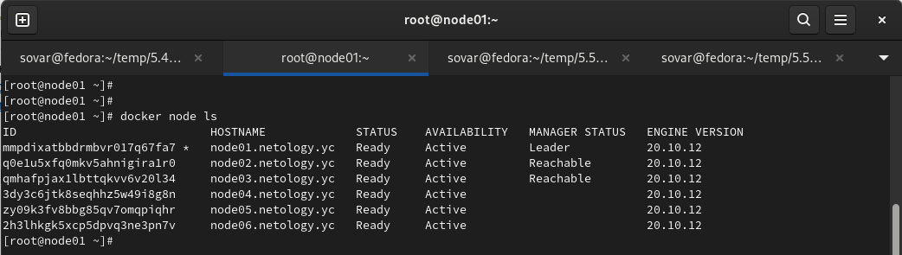

> 3. Создать ваш первый, готовый к боевой эксплуатации кластер мониторинга, состоящий из стека микросервисов.
Для получения зачета, вам необходимо предоставить скриншот из терминала (консоли), с выводом команды:
`docker service ls`

Ответ:

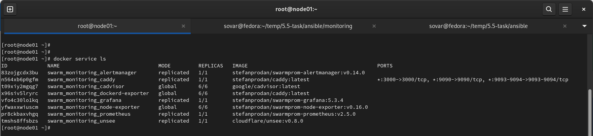

> 4. Выполнить на лидере Docker Swarm кластера команду (указанную ниже) и дать письменное описание её функционала, что она делает и зачем она нужна:
см.документацию: https://docs.docker.com/engine/swarm/swarm_manager_locking/
`docker swarm update --autolock=true`

Ответ:
Логи по выбору лидера из менеджеров шифруются по умолчанию. Таким образом обеспечивается собственно безопасность. Трафик между нодами в том, числе шифруется по той же причине. Ключи шифрования и логов, и трафика, на момент рестарта Docker помещаются в память менеджеров. Вы становитесь владельцем заблокированных таким способом ключей и необходимо ручная разблокировка менеджеров, после того как ребут закончился.
Разблокировка происходит тем ключом, который генерировался на момент блока.
```
[root@node01 ~]# docker swarm update --autolock=true
Swarm updated.
To unlock a swarm manager after it restarts, run the `docker swarm unlock`
command and provide the following key:

    SWMKEY-1-K9aFG5dQ/rSVx0NC43spQc5xORF+/jDrpRSQsREylMc

Please remember to store this key in a password manager, since without it you
will not be able to restart the manager.
```
```
[root@node01 ~]# docker node ls
Error response from daemon: Swarm is encrypted and needs to be unlocked before it can be used. Please use "docker swarm unlock" to unlock it.
```

## Задание - 5.4. Оркестрация группой Docker контейнеров на примере Docker Compose

> 1. Создать собственный образ операционной системы с помощью Packer. Для получения зачета, вам необходимо предоставить: Скриншот страницы, как на слайде из презентации (слайд 37)

Ответ:
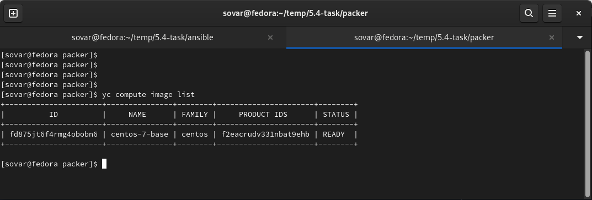

> 2. Создать вашу первую виртуальную машину в Яндекс.Облаке. Для получения зачета, вам необходимо предоставить: Скриншот страницы свойств созданной ВМ

Ответ:
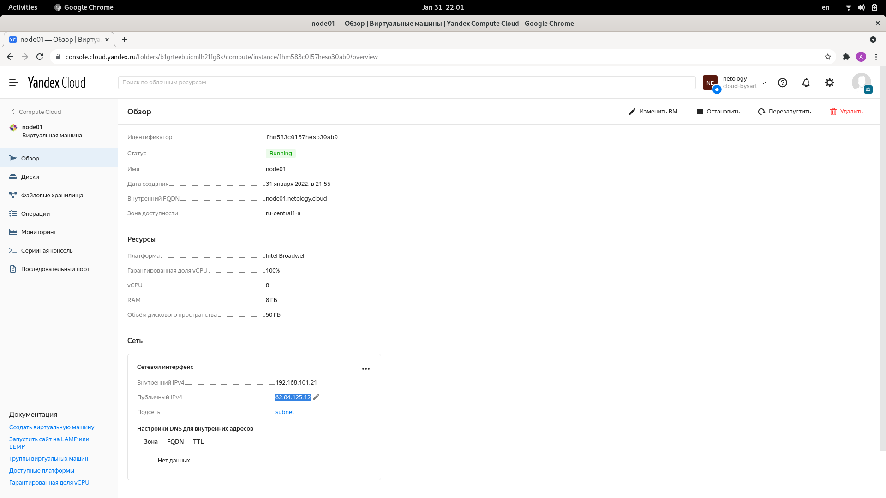

> 3. Создать ваш первый готовый к боевой эксплуатации компонент мониторинга, состоящий из стека микросервисов. Для получения зачета, вам необходимо предоставить: Скриншот работающего веб-интерфейса Grafana с текущими метриками

Ответ:
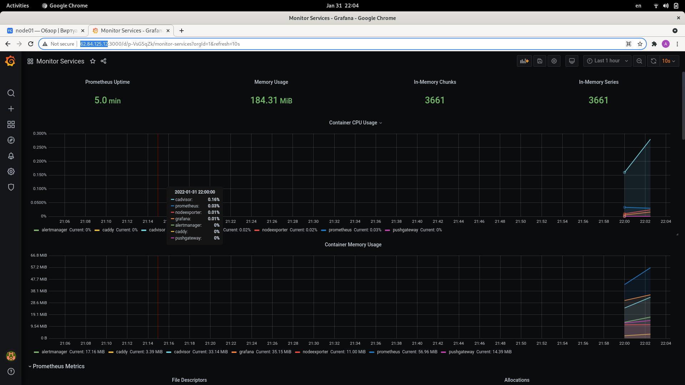

## Задание - 5.3. Введение. Экосистема. Архитектура. Жизненный цикл Docker контейнера.

> 1. Сценарий выполнения задачи: создайте свой репозиторий на https://hub.docker.com; 
выберете любой образ, который содержит веб-сервер Nginx;
создайте свой fork образа;
реализуйте функциональность: запуск веб-сервера в фоне с индекс-страницей, содержащей HTML-код ниже.
Опубликуйте созданный форк в своем репозитории и предоставьте ответ в виде ссылки на https://hub.docker.com/username_repo.
```
<html>
<head>
Hey, Netology
</head>
<body>
<h1>I’m DevOps Engineer!</h1>
</body>
</html>
```

Ответ: 
https://hub.docker.com/r/bysart/alpine-ngnix

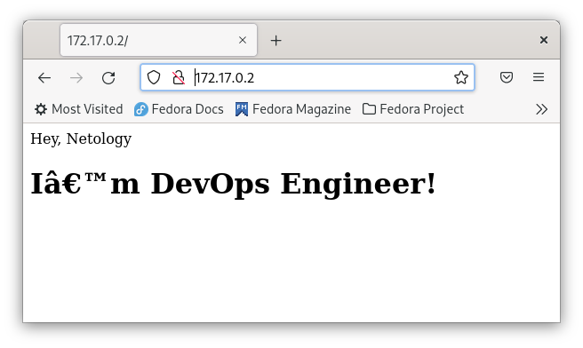

> 2. Посмотрите на сценарий ниже и ответьте на вопрос: "Подходит ли в этом сценарии использование Docker контейнеров или лучше подойдет виртуальная машина, физическая машина? Может быть возможны разные варианты?"
Детально опишите и обоснуйте свой выбор.

Ответ:
- Высоконагруженное монолитное java веб-приложение - монолитное веб-приложение предполагает сборку всего в одном месте (frontend, backend, UI). Так как монолитное веб-приложение высоконагруженное, то стоит размещать или на физической среде, или можно использовать пара виртуализацию, если накладными расходами можно пренебречь, однако контейнеризация не подойдет, так предполагается выполнение одного сервиса в рамках контейнера. 
- Nodejs веб-приложение - контейнеризация подойдет для решения задачи, по сути node.js - это условно говоря environment для javascript для построения логики работы веб-приложения, является его частью, модулем, хорошо укладывается в микро сервисную архитектуру.
- Мобильное приложение c версиями для Android и iOS - предполагается, что приложение имеет своего потребителя, а значит необходим UI для взаимодействия с пользователем. По моему мнению, корректнее всего использовать виртуализацию с реализацией виртуальной машины.
- Шина данных на базе Apache Kafka - если можно так выразится, то это сервис по трансляции данных из одного формата данных одного приложения в другое. По моему мнению хорошо применить контейнеризацию, так как отсутствуют накладные расходы на виртуализацию, достигается простота масштабирования и управления. В данном случае необходимо организация отказоустойчивости.
- Elasticsearch кластер для реализации логирования продуктивного веб-приложения - три ноды elasticsearch, два logstash и две ноды kibana - для упомянутых продуктов есть контейнеры на docker hub. Из-за простоты управления и сборки контейнеров, мне кажется необходимо распихать продукты по контейнерам и на основании контейнеров собрать кластер стека ELK. В силу прозрачности реализации, в том числе возможности реализации подходов IaaC, контейнеризация в данном случае помогает закрыть вопросы по менеджменту и что очень важно получить регулярный предсказуемый результат. 
- Мониторинг-стек на базе Prometheus и Grafana - по моему мнению также как и пример с ELK, скорее всего с течением времени будут вноситься изменения в систему мониторинга и не один раз, будут добавляется метрики, так как точки мониторинга будут меняться - добавляться новый функционал, было бы не плохо применить IaaC в том числе и в этом случае - мониторинг как код, контейнеризация помогает этого добиться.
- MongoDB, как основное хранилище данных для java-приложения - либо виртуализация, либо контейнеризация, все зависит от реализации архитектуры приложения. Сложно дать вразумительный ответ - никогда не работал с данной БД, затрудняюсь обосновать выбор. Чувствую, что так будет правильно.
- Gitlab сервер для реализации CI/CD процессов и приватный (закрытый) Docker Registry - отдельный физический сервер или виртуализация, если сервер есть в наличии использовал бы его, но только необходимо оценить доступные объемы хранения данных, в том числе подумать о техническом сопровождении: просчитать затраты на поддержку железа и ЗИП. Если по совокупности поставленных задач будет понятно, что через осязаемое недалекое время мы выйдем за пределы мощностей физ. сервера, то выбрал бы, на перспективу, виртуализацию, однако возможны первичные затраты на доп. железо, но все зависит от проекта. Требуется пред проектная аналитика.

> 3. Запустите первый контейнер из образа centos c любым тэгом в фоновом режиме, подключив папку /data из текущей рабочей директории на хостовой машине в /data контейнера;
Запустите второй контейнер из образа debian в фоновом режиме, подключив папку /data из текущей рабочей директории на хостовой машине в /data контейнера;
Подключитесь к первому контейнеру с помощью docker exec и создайте текстовый файл любого содержания в /data;
Добавьте еще один файл в папку /data на хостовой машине;
Подключитесь во второй контейнер и отобразите листинг и содержание файлов в /data контейнера.

Ответ:

Подымаем первый контейнер, так как в контейнере определена команда CMD bash, то при запуске выполняется запуск bash и контейнер уходит в статус stop, поэтому применяю sleep infinity, можно было использовать ключ -t. При помощи exec, на уже запущеном контейнере вызываю bash, через ls показываю примапленный volume.
```
[sovar@fedora docker]$ docker run -d -v /data:/data centos sleep infinity
867d3a86aa2a60f3806d1d5d25c0957676cd8942d1fea34263584466491eb670

[sovar@fedora docker]$ docker ps
CONTAINER ID   IMAGE     COMMAND            CREATED         STATUS         PORTS     NAMES
867d3a86aa2a   centos    "sleep infinity"   4 seconds ago   Up 4 seconds             bold_tu

[sovar@fedora docker]$ docker exec -it 867d3a86aa2a bash
[root@867d3a86aa2a /]#

[root@867d3a86aa2a /]# ls -lah /
total 60K
drwxr-xr-x   1 root root 4.0K Jan 24 20:21 .
drwxr-xr-x   1 root root 4.0K Jan 24 20:21 ..
-rwxr-xr-x   1 root root    0 Jan 24 20:21 .dockerenv
lrwxrwxrwx   1 root root    7 Nov  3  2020 bin -> usr/bin
drwxr-xr-x   2 root root 4.0K Jan 24 19:12 data
drwxr-xr-x   5 root root  340 Jan 24 20:21 dev
drwxr-xr-x   1 root root 4.0K Jan 24 20:21 etc
drwxr-xr-x   2 root root 4.0K Nov  3  2020 home
lrwxrwxrwx   1 root root    7 Nov  3  2020 lib -> usr/lib
lrwxrwxrwx   1 root root    9 Nov  3  2020 lib64 -> usr/lib64
drwx------   2 root root 4.0K Sep 15 14:17 lost+found
drwxr-xr-x   2 root root 4.0K Nov  3  2020 media
drwxr-xr-x   2 root root 4.0K Nov  3  2020 mnt
drwxr-xr-x   2 root root 4.0K Nov  3  2020 opt
dr-xr-xr-x 363 root root    0 Jan 24 20:21 proc
dr-xr-x---   2 root root 4.0K Sep 15 14:17 root
drwxr-xr-x  11 root root 4.0K Sep 15 14:17 run
lrwxrwxrwx   1 root root    8 Nov  3  2020 sbin -> usr/sbin
drwxr-xr-x   2 root root 4.0K Nov  3  2020 srv
dr-xr-xr-x  13 root root    0 Jan 24 20:21 sys
drwxrwxrwt   7 root root 4.0K Sep 15 14:17 tmp
drwxr-xr-x  12 root root 4.0K Sep 15 14:17 usr
drwxr-xr-x  20 root root 4.0K Sep 15 14:17 var
```

Аналогичные действия для контейнера с debian, исключение составляет порядок ключей, эксперимент - последовательность ключей не играет роли, заметка в дневник, уточнить у экспертов.

```
[sovar@fedora docker]$ docker run -v /data:/data -d debian sleep infinity
4561ae7cd80e4a6b87c042a9d4d020a37ab712662aae697af45404bf9a61bda8

[sovar@fedora docker]$ docker ps
CONTAINER ID   IMAGE     COMMAND            CREATED         STATUS         PORTS     NAMES
4561ae7cd80e   debian    "sleep infinity"   5 seconds ago   Up 4 seconds             friendly_maxwell
867d3a86aa2a   centos    "sleep infinity"   3 minutes ago   Up 3 minutes             bold_tu
 
root@4561ae7cd80e:/# ls -lah /
total 76K
drwxr-xr-x   1 root root 4.0K Jan 24 20:25 .
drwxr-xr-x   1 root root 4.0K Jan 24 20:25 ..
-rwxr-xr-x   1 root root    0 Jan 24 20:25 .dockerenv
drwxr-xr-x   2 root root 4.0K Dec 20 00:00 bin
drwxr-xr-x   2 root root 4.0K Dec 11 17:25 boot
drwxr-xr-x   2 root root 4.0K Jan 24 19:12 data
drwxr-xr-x   5 root root  340 Jan 24 20:25 dev
drwxr-xr-x   1 root root 4.0K Jan 24 20:25 etc
drwxr-xr-x   2 root root 4.0K Dec 11 17:25 home
drwxr-xr-x   8 root root 4.0K Dec 20 00:00 lib
drwxr-xr-x   2 root root 4.0K Dec 20 00:00 lib64
drwxr-xr-x   2 root root 4.0K Dec 20 00:00 media
drwxr-xr-x   2 root root 4.0K Dec 20 00:00 mnt
drwxr-xr-x   2 root root 4.0K Dec 20 00:00 opt
dr-xr-xr-x 307 root root    0 Jan 24 20:25 proc
drwx------   2 root root 4.0K Dec 20 00:00 root
drwxr-xr-x   3 root root 4.0K Dec 20 00:00 run
drwxr-xr-x   2 root root 4.0K Dec 20 00:00 sbin
drwxr-xr-x   2 root root 4.0K Dec 20 00:00 srv
dr-xr-xr-x  13 root root    0 Jan 24 20:25 sys
drwxrwxrwt   2 root root 4.0K Dec 20 00:00 tmp
drwxr-xr-x  11 root root 4.0K Dec 20 00:00 usr
drwxr-xr-x  11 root root 4.0K Dec 20 00:00 var
```

С контейнера под centos создаю в директории файл

```
[root@867d3a86aa2a /]# echo '' > /data/centos-file-1
[root@867d3a86aa2a /]# ls /data
centos-file-1
```

Созадю файл с хоста 

```
[sovar@fedora docker]$ echo '' > /data/fedora-host-file-2
[sovar@fedora docker]$ ls /data
centos-file-1  fedora-host-file-2
```

Листинг файлов в директории из контейнера debian

```
root@4561ae7cd80e:/# ls -lah /data
total 16K
drwxr-xrwx 2 root root 4.0K Jan 24 20:38 .
drwxr-xr-x 1 root root 4.0K Jan 24 20:25 ..
-rw-r--r-- 1 root root    1 Jan 24 20:29 centos-file-1
-rw-rw-r-- 1 1000 1000    1 Jan 24 20:38 fedora-host-file-2
```

> 4. Воспроизвести практическую часть лекции самостоятельно. Соберите Docker образ с Ansible, загрузите на Docker Hub и пришлите ссылку вместе с остальными ответами к задачам.

Ответ:
https://hub.docker.com/r/bysart/ansible

## Задание - 5.2. Применение принципов IaaC в работе с виртуальными машинами.

> 1. Опишите своими словами основные преимущества применения на практике IaaC паттернов.
Какой из принципов IaaC является основополагающим?

Ответ: 
IaaC - качественно новый подход к ведению дел в Ops. Это одномоментно и техническая реализация поставленной задачи, и документирование действий, настроек. Кодинг для описания инфраструктуры приводит нас к тому, что не плохо было бы разбираться в программировании, и с точки зрения получения финального продукта - программы (в рамках Ops - код инфраструктуры), и сточки зрения - а как писать код, как его структурировать, как применять эффективные методы описания логики. В данном случае работает правило: не изобретай велосипед, все что тебе нужно, уже было сделано до тебя, тебе остается знать опыт разработки IaaC, понимать когда и что использовать и осознанно, с ответственностью, применять то или иное в работе, да, всегда, остается место для творчества и реализации, но применение паттернов IaaC опоравдано оптимизационно и функционально. Вообще, основополагающем принципом, в рамках IaaC, является обеспеченеи идемпотентности. По моему мнению, именно паттерны, которые формировались в рамка развития той или технологии - квинтэссенция максимально эффективного опыта ИТ специалистов и обеспечивает стабильность получения предсказуемого постоянного результата.    

> 2. Чем Ansible выгодно отличается от других систем управление конфигурациями?
Какой, на ваш взгляд, метод работы систем конфигурации более надёжный push или pull?

Ответ: 
Ansible написан на Python, использует метод push, что не требует установки ни демонов, ни агентов, в случае с pull методом такие агенты нужны, что потенциально может быть еще одной точкой сбоя. Использует SSH без необходимости дополнительно докручивать PKI. По совокупности, все это делает Ansible простым и эффективным. 

> 3. Установить на личный компьютер: VirtualBox, Vagrant, Ansible.
Приложить вывод команд установленных версий каждой из программ, оформленный в markdown.

Ответ:
```
[sovar@fedora ~]$ vboxmanage --version
6.1.32r149290
```
```
[sovar@fedora ~]$ vagrant -v
Vagrant 2.2.19
```
```
[sovar@fedora ~]$ ansible --version
ansible 2.9.27
  config file = /etc/ansible/ansible.cfg
  configured module search path = ['/home/sovar/.ansible/plugins/modules', '/usr/share/ansible/plugins/modules']
  ansible python module location = /usr/lib/python3.10/site-packages/ansible
  executable location = /usr/bin/ansible
  python version = 3.10.0 (default, Oct  4 2021, 00:00:00) [GCC 11.2.1 20210728 (Red Hat 11.2.1-1)]
```

> 4. Воспроизвести практическую часть лекции самостоятельно. Создать виртуальную машину.
Зайти внутрь ВМ, убедиться, что Docker установлен с помощью команды `docker ps`

Ответ:
```
[sovar@fedora vagrant]$ vagrant ssh
Welcome to Ubuntu 20.04.3 LTS (GNU/Linux 5.4.0-91-generic x86_64)

 * Documentation:  https://help.ubuntu.com
 * Management:     https://landscape.canonical.com
 * Support:        https://ubuntu.com/advantage

 System information disabled due to load higher than 1.0


This system is built by the Bento project by Chef Software
More information can be found at https://github.com/chef/bento
Last login: Thu Jan 20 08:02:10 2022 from 10.0.2.2
vagrant@server1:~$ docker ps
CONTAINER ID   IMAGE     COMMAND   CREATED   STATUS    PORTS     NAMES
```

## Задание - 5.1. Введение в виртуализацию. Типы и функции гипервизоров. Обзор рынка вендоров и областей применения.

> 1. Опишите кратко, как вы поняли: в чем основное отличие полной (аппаратной) виртуализации, паравиртуализации и виртуализации на основе ОС.

Ответ:
- Аппаратная (полная) виртуализация - полная эмуляция процессора, памяти и необходимых перифирийных устройств, в силу чего большие накладные расходы, что может выливаться в уменьшение производительности. Однако данные проблемы отчасти закрываются динамической трансляцией и реализацией аппаратной виртуализации Inet-VT, AMD-V.
- Паравиртулизация - в том числе эмуляция работы устройств, однако гостевая ОС знает о наличии гипервизора, а выполнения привилегированных инструкций происходит через гипервизор, поэтому происходит серьезное изменение ядра гостевой ОС. В силу данной особенности подходит для ОС с открытым кодом, издержки меньше, производительность не особо страдает.
- Виртуализация на основе ОС - еще называется контейнеризация, при помощи механизмов namespace и cgroups, можно выделять новые пространства имен, ограничивать ресурсы хостовой машины, тем самым создавать изолированные контейнеры, в которых будут выполняться процессы. Ядро гостевой ОС не может отличаться от ядра хостовой ОС.


> 2. Выберите один из вариантов использования организации физических серверов, в зависимости от условий использования. Опишите, почему вы выбрали к каждому целевому использованию такую организацию.

Ответ:
1. Высоконагруженная база данных, чувствительная к отказу: виртуализация уровня ОС - так БД можно рассматривать, как приложение (сервис), по моему мнению необходимо запаковать это в контейнер, создать несколько таких контейнеров, тем самым получить отказоустойчивый кластер, управление контейнером сводится к управлению процессом - быстро и без накладных расходов.
2. Различные web-приложения: виртуализация уровня ОС - если приложения могут и должны работать на том же ядре, что и ядро хостовой ОС, если, все же, в связи с этим есть ограничения, тогда паравиртуализация. Так как это web-приложения, то это значит, что будет достаточно много обращений к ним, как к сервису, поэтому нам в первую очередь необходимо обеспечить хорошую производительность и снизить накладные расходы. Данный способ так же позволяет утилизировать по максимуму хостовые ресурсы, управление контейнерами позволит нам упростить в принципе управление стеком веб приложений. 
3. Windows системы для использования бухгалтерским отделом: паравиртуализация - системы для бухов - по большей части, не требуют от нас супер производительности и кол-во обращение более менее прогнозируемое и поддается подсчету. Виртуализация более масштабируемое решение, скорее всего можно сформировать единую точку управления.
4. Системы, выполняющие высокопроизводительные расчеты на GPU: физические сервера - так как потребуется установка мощных графических процессоров для обработки данных. Хотя, графические интерфейсы в том, числе виртуализируются, однако предполагаю, что все таки физические решения для графических вычислений более производительны.

П.С. Хотел бы отметить, что при выборе того или иного решения, необходимо проводить более глубокую аналитику - что за приложения будут выполняться, какие задачи будут решать новые сервисы, в том числе необходимо учитывать и анализировать не только страт проекта, но и делать выбор с учетом требования по отказоустойчивости и масштабируемости. Возможно было бы уместно для типовых задач проанализировать ИТ опыт, так сказать рассмотреть best practice. А также не мало важно учитывать бюджет проекта.

> 3. Выберите подходящую систему управления виртуализацией для предложенного сценария. Детально опишите ваш выбор.

Ответ: 

Сценарий 1: VMWare. В рамках продуктов виртуализации и управления, решения от VMWare являются наиболее сбалансированными, имеют достаточно обширный функционал, который позволит закрыть вопросы по сопровождению и администрированию среды на 100 VM Windows, Linux.

Сценарий 2: KVM. Решение на базе KVM позволит управлять гостевыми ОС, как Windows, так и Linux, без особых потерь в производительности, что обеспечивает решение поставленной задачи. Проект развивающийся, это несет в себе риски, но ими можно пренебречь, так как производительность нас интересует в первую очередь. 

Сценарий 3: XEN PV. Решение позволит поднять инфраструктуру на базе Windows OS, является open source проектом, обеспечит высокую производительность.

Сценарий 4: Virtual Box совместно с Vagrant. Для создания окружения для тестирования подойдет open source решение Virtual Box, с помощью Vagrant можно добиться автоматизации сборки такого окружения, при помощи Vagrantfile отдавать данное окружения всем, кто заинтересован, это позволит точно быть уверенным, что среда у всех единая.

> 4. Опишите возможные проблемы и недостатки гетерогенной среды виртуализации (использования нескольких систем управления виртуализацией одновременно) и что необходимо сделать для минимизации этих рисков и проблем. Если бы у вас был выбор, то создавали бы вы гетерогенную среду или нет? Мотивируйте ваш ответ примерами.

Ответ: выбор среды виртуализации делается на основании плотного пред проектного анализа, рассматривается детальное описание требований к будущей реализации, мое мнение такое, если мы можем на проекте избежать солянки из продуктов и решений, то ни к чему вводить два или более решений по управлению виртуальной средой. Однако, если же этого не избежать, специфика поставленной задачи, такова, что гетерогенная среда будет оправдана, и с точки зрения затрат, и с точки зрения управления, то тогда необходимо внедрять такое решение, но учитывать особенности - две или более точки управления виртуальными средами, это в свою очередь тянет за собой и необходимость привлекать более скиловый персонал, объем выполняемых работ увеличиться, потребуется разработка автоматизационных решений под обе среды, возможно это наложит существенные ограничения на выбор стека технологий по мониторингу, логированию и бекапированию или наоборот увеличит кол-во продуктов. В том числе значительно усложняется вопрос по реализации прозрачного процесса управления изменениями, то есть изменения, которые будут доставляться в одну среду, могут отличаться в смысле способа и метода доставки в другой среде. Для минимизации влияния всех описаных факторов, техническое решение должно быть проработано хорошо, задача отладки процессов управления сервисов в гетерогенной среде становиться крайне важна, в том числе для страховки необходимо будет прорабатывать детальный план DRP - disaster recovery plan. По моему личному мнению, гетерогенная среда виртуализации - требует определенного баланса между необходмиым и достаточным, необходимо отдавать себе отчет в том, какой стек технологий будет использоваться, и точно не стоит боятся, необходимо ответственно подходить к архитектуре решения. 

## Курсовая работа "DevOps и системное администрирование"

Задание:

Результатом курсовой работы должны быть снимки экрана или текст:
1. Процесс установки и настройки ufw
2. Процесс установки и выпуска сертификата с помощью hashicorp vault 
3. Процесс установки и настройки сервера nginx 
4. Страница сервера nginx в браузере хоста не содержит предупреждений 
5. Скрипт генерации нового сертификата работает (сертификат сервера ngnix должен быть "зеленым")
6. Crontab работает (выберите число и время так, чтобы показать что crontab запускается и делает что надо)

Решение:

1. Процесс установки и настройки ufw
```
sudo apt install ufw
```

```
sudo ufw default deny incoming
Default incoming policy changed to 'deny'
(be sure to update your rules accordingly)
```

```
sudo ufw default allow outgoing
Default outgoing policy changed to 'allow'
(be sure to update your rules accordingly)
``` 

```
sudo ufw enable 
Command may disrupt existing ssh connections. Proceed with operation (y|n)? y
Firewall is active and enabled on system startup
```

```
sudo ufw allow 22
```

```
sudo ufw allow 443
```

```
sudo ufw logging on medium
Logging enabled
```

```
sudo ufw status verbose 
[sudo] password for sovar: 
Status: active
Logging: on (low)
Default: deny (incoming), allow (outgoing), disabled (routed)
New profiles: skip

To                         Action      From
--                         ------      ----
22                         ALLOW IN    Anywhere                  
443                        ALLOW IN    Anywhere                  
22 (v6)                    ALLOW IN    Anywhere (v6)             
443 (v6)                   ALLOW IN    Anywhere (v6)             
```

2. Процесс установки и выпуска сертификата с помощью hashicorp vault

```
curl -fsSL https://apt.releases.hashicorp.com/gpg | sudo apt-key add -
Warning: apt-key is deprecated. Manage keyring files in trusted.gpg.d instead (see apt-key(8)).
OK
```

```
sudo apt-add-repository "deb [arch=amd64] https://apt.releases.hashicorp.com $(lsb_release -cs) main"
```

```
sudo apt-get update ; sudo apt-get install vault
```

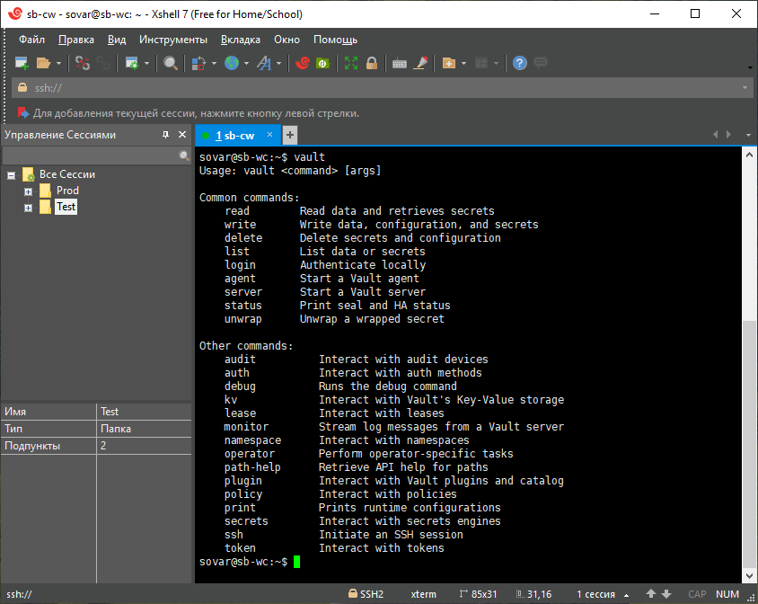

```
vault server -dev -dev-root-token-id root
```

```
export VAULT_ADDR=http://127.0.0.1:8200
```

```
export VAULT_TOKEN=root
```

```
vault secrets enable pki
```

```
vault secrets tune -max-lease-ttl=87600h pki
```

```
vault write -field=certificate pki/root/generate/internal \
common_name="DevOps Netology CA" \
ttl=87600h > CA_cert.crt
```

```
vault write pki/config/urls \
issuing_certificates="$VAULT_ADDR/v1/pki/ca" \
crl_distribution_points="$VAULT_ADDR/v1/pki/crl"
```

После, созданный сертификат добавляю в доверительные сертификаты на хостовых машинах.

```
vault write pki/roles/devops-netology-ca \
allowed_domains="course-work.ru" \
allow_bare_domains=true \
max_ttl="8760h"
Success! Data written to: pki/roles/devops-netology-ca
```

```
vault write pki/issue/devops-netology-ca common_name="course-work.ru" ttl="720h"
```


3. Процесс установки и настройки сервера nginx

```
sudo apt install nginx
```

```
systemctl status nginx.service 
● nginx.service - A high performance web server and a reverse proxy server
     Loaded: loaded (/lib/systemd/system/nginx.service; enabled; vendor preset: enabled)
     Active: active (running) since Thu 2021-12-23 15:39:12 MSK; 1min 16s ago
       Docs: man:nginx(8)
    Process: 7221 ExecStartPre=/usr/sbin/nginx -t -q -g daemon on; master_process on; (code=exited, status=0/SUCCESS)
    Process: 7222 ExecStart=/usr/sbin/nginx -g daemon on; master_process on; (code=exited, status=0/SUCCESS)
   Main PID: 7305 (nginx)
      Tasks: 3 (limit: 4642)
     Memory: 3.3M
        CPU: 75ms
     CGroup: /system.slice/nginx.service
             ├─7305 nginx: master process /usr/sbin/nginx -g daemon on; master_process on;
             ├─7308 nginx: worker process
             └─7309 nginx: worker process
```

```
sudo nano /etc/hosts
127.0.0.1	course-work.ru
```

```
server {
        listen 80 default_server;

        # SSL configuration
        listen 443 ssl;
        ssl_certificate     /etc/nginx/cert/cert;
        ssl_certificate_key /etc/nginx/cert/key;
        ssl_protocols       TLSv1 TLSv1.1 TLSv1.2;
        ssl_ciphers         HIGH:!aNULL:!MD5;

	server_name course-work.ru;
```

4. Страница сервера nginx в браузере хоста не содержит предупреждений


5. Скрипт генерации нового сертификата работает (сертификат сервера ngnix должен быть "зеленым")

```
#!/usr/bin/bash

/usr/bin/curl --header "X-Vault-Token: root" \
    --request POST \
    --data '{"common_name": "course-work.ru", "ttl": "720h"}' \
    http://127.0.0.1:8200/v1/pki/issue/devops-netology-ca | jq >/home/sovar/gen-data.json

/usr/bin/jq -r '.data.certificate' /home/sovar/gen-data.json >/home/sovar/cert2 
/usr/bin/jq -r '.data.private_key' /home/sovar/gen-data.json >/home/sovar/key2

/usr/bin/cp /home/sovar/cert2 /etc/nginx/cert/cert 
/usr/bin/cp /home/sovar/key2 /etc/nginx/cert/key

/usr/bin/systemctl restart nginx.service
```

6. Crontab работает (выберите число и время так, чтобы показать что crontab запускается и делает что надо)

```
sudo crontab -e
```

```
*/1 * * * *  /home/sovar/update_cert.sh
```

Для простоты генерации события поставил вполнение каждую минуту, для выполнения требований курсовой работы необходимо указать:

```
* 23 28 * *  /home/sovar/update_cert.sh
```

Финальные скрины сертификата:

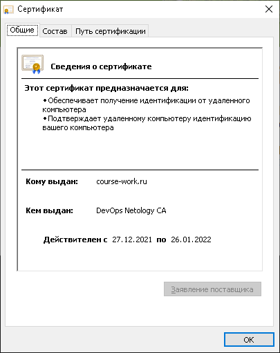

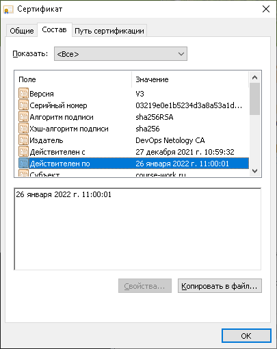

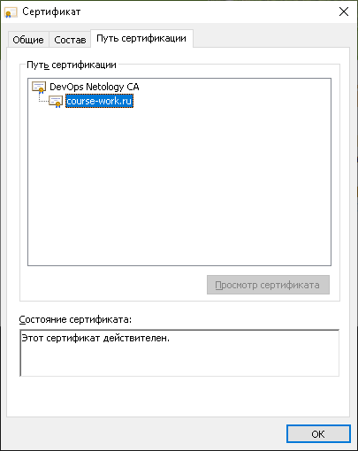

## Домашнее задание к занятию "4.3. Языки разметки JSON и YAML"

## Обязательная задача 1
Мы выгрузили JSON, который получили через API запрос к нашему сервису:
```
    { "info" : "Sample JSON output from our service\t",
        "elements" :[
            { "name" : "first",
            "type" : "server",
            "ip" : 7175 
            },
            { "name" : "second",
            "type" : "proxy",
            "ip" : "71.78.22.43"
            }
        ]
    }
```
  Нужно найти и исправить все ошибки, которые допускает наш сервис

## Обязательная задача 2
В прошлый рабочий день мы создавали скрипт, позволяющий опрашивать веб-сервисы и получать их IP. К уже реализованному функционалу нам нужно добавить возможность записи JSON и YAML файлов, описывающих наши сервисы. Формат записи JSON по одному сервису: `{ "имя сервиса" : "его IP"}`. Формат записи YAML по одному сервису: `- имя сервиса: его IP`. Если в момент исполнения скрипта меняется IP у сервиса - он должен так же поменяться в yml и json файле.

### Ваш скрипт:
```python
#!/usr/bin/env python3

import socket
import json
import yaml


file_old = open('ip_add.log', 'r')
stage_ipadds = json.loads(file_old.read())

ip_item = []
dns_item = ["drive.google.com", "mail.google.com", "google.com"]
for resolv in dns_item:
    ip_item.append(socket.gethostbyname(resolv))
current_ipadds = dict(zip(dns_item, ip_item))

stage_ipadds_new = open('ip_add.log', 'w')
stage_ipadds_new.write(json.dumps(current_ipadds))
stage_ipadds_new.close()

print('For check:')
print(current_ipadds)
print(f'{stage_ipadds}\n')

with open('first.json', 'w') as js:
    js.write('')
with open('second.yml', 'w') as ym:
    ym.write('')

for i in current_ipadds:
    if (current_ipadds[i] == stage_ipadds[i]):
        print(f'<{i}> - <{current_ipadds[i]}>')
        rr = {i: current_ipadds[i]}
        with open('first.json', 'a') as js:
            js.write(f'{json.dumps(rr)}\n')
        with open('second.yml', 'a') as ym:
            ym.write(yaml.dump(rr))
    else:
        print(f'[ERROR] <{i}> IP mismatch: <{stage_ipadds[i]}> <{current_ipadds[i]}>')
        rr2 = {i: current_ipadds[i]}
        with open('first.json', 'a') as js:
            js.write(f'{json.dumps(rr2)}\n')
        with open('second.yml', 'a') as ym:
            ym.write(yaml.dump(rr2))
```

### Вывод скрипта при запуске при тестировании:

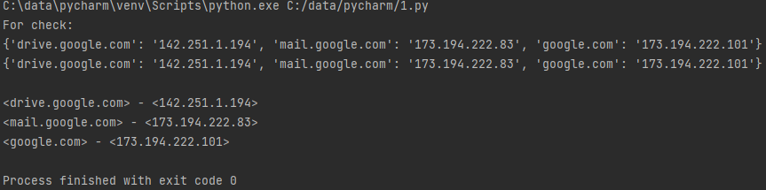

### json-файл(ы), который(е) записал ваш скрипт:
```json
{"drive.google.com": "142.251.1.194"}
{"mail.google.com": "173.194.222.83"}
{"google.com": "173.194.222.101"}
```

### yml-файл(ы), который(е) записал ваш скрипт:
```yaml
drive.google.com: 142.251.1.194
mail.google.com: 173.194.222.83
google.com: 173.194.222.101
```

# Домашнее задание к занятию "4.2. Использование Python для решения типовых DevOps задач"

## Обязательная задача 1

Есть скрипт:
```python
#!/usr/bin/env python3
a = 1
b = '2'
c = a + b
```

### Вопросы:
| Вопрос  | Ответ |
| ------------- | ------------- |
| Какое значение будет присвоено переменной `c`?  | сложение произвести не получится str нельзя складывать с int  |
| Как получить для переменной `c` значение 12?  | c = str(a) + b |
| Как получить для переменной `c` значение 3?  | a + int(b) |

## Обязательная задача 2
Мы устроились на работу в компанию, где раньше уже был DevOps Engineer. Он написал скрипт, позволяющий узнать, какие файлы модифицированы в репозитории, относительно локальных изменений. Этим скриптом недовольно начальство, потому что в его выводе есть не все изменённые файлы, а также непонятен полный путь к директории, где они находятся. Как можно доработать скрипт ниже, чтобы он исполнял требования вашего руководителя?

```python
#!/usr/bin/env python3

import os

bash_command = ["cd ~/netology/sysadm-homeworks", "git status"]
result_os = os.popen(' && '.join(bash_command)).read()
is_change = False
for result in result_os.split('\n'):
    if result.find('modified') != -1:
        prepare_result = result.replace('\tmodified:   ', '')
        print(prepare_result)
        break
```

### Ваш скрипт:
```python
#!/usr/bin/env python3

import os

bash_command = ["cd ~/Documents/py", "git status"]
result_os = os.popen(' && '.join(bash_command)).read()

for result in result_os.split('\n'):
    if result.find('modified') != -1:
        prepare_result = result.replace('\tmodified:   ', '')
        print(f'/home/sovar/Documents/py/{prepare_result}')
```

### Вывод скрипта при запуске при тестировании:

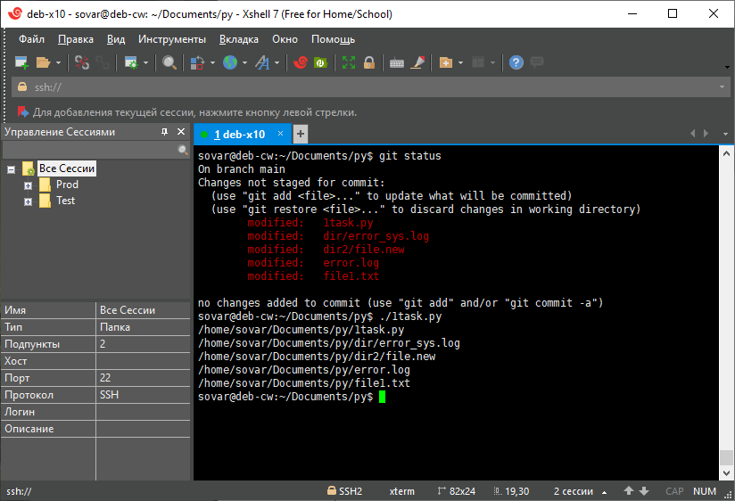

## Обязательная задача 3
1. Доработать скрипт выше так, чтобы он мог проверять не только локальный репозиторий в текущей директории, а также умел воспринимать путь к репозиторию, который мы передаём как входной параметр. Мы точно знаем, что начальство коварное и будет проверять работу этого скрипта в директориях, которые не являются локальными репозиториями.

### Ваш скрипт:
```python
#!/usr/bin/env python3

import os, sys

param = sys.argv[1]
bash_command = [f'cd {param}', "git status"]
result_os = os.popen(' && '.join(bash_command)).read()

for result in result_os.split('\n'):
    if result.find('modified') != -1:
        prepare_result = result.replace('\tmodified:   ', '')
        print(f'{param}/{prepare_result}')
```

### Вывод скрипта при запуске при тестировании:

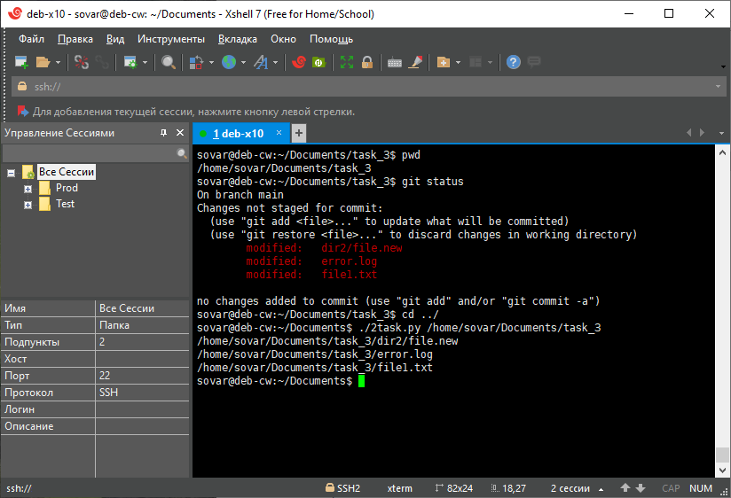

## Обязательная задача 4
1. Наша команда разрабатывает несколько веб-сервисов, доступных по http. Мы точно знаем, что на их стенде нет никакой балансировки, кластеризации, за DNS прячется конкретный IP сервера, где установлен сервис. Проблема в том, что отдел, занимающийся нашей инфраструктурой очень часто меняет нам сервера, поэтому IP меняются примерно раз в неделю, при этом сервисы сохраняют за собой DNS имена. Это бы совсем никого не беспокоило, если бы несколько раз сервера не уезжали в такой сегмент сети нашей компании, который недоступен для разработчиков. Мы хотим написать скрипт, который опрашивает веб-сервисы, получает их IP, выводит информацию в стандартный вывод в виде: <URL сервиса> - <его IP>. Также, должна быть реализована возможность проверки текущего IP сервиса c его IP из предыдущей проверки. Если проверка будет провалена - оповестить об этом в стандартный вывод сообщением: [ERROR] <URL сервиса> IP mismatch: <старый IP> <Новый IP>. Будем считать, что наша разработка реализовала сервисы: `drive.google.com`, `mail.google.com`, `google.com`.

### Ваш скрипт:
```python
#!/usr/bin/env python3

import socket
import json

file_old = open('ip_add.log', 'r')
stage_ipadds = json.loads(file_old.read())

ip_item = []
dns_item = ["drive.google.com", "mail.google.com", "google.com"]
for resolv in dns_item:
    ip_item.append(socket.gethostbyname(resolv))
current_ipadds = dict(zip(dns_item, ip_item))

stage_ipadds_new = open('ip_add.log', 'w')
stage_ipadds_new.write(json.dumps(current_ipadds))
stage_ipadds_new.close()

print('For check:')
print(current_ipadds)
print(f'{stage_ipadds}\n')

for i in current_ipadds:
    if (current_ipadds[i] == stage_ipadds[i]):
        print(f'<{i}> - <{current_ipadds[i]}>')
    else:
        print(f'[ERROR] <{i}> IP mismatch: <{stage_ipadds[i]}> <{current_ipadds[i]}>')
```

### Вывод скрипта при запуске при тестировании:

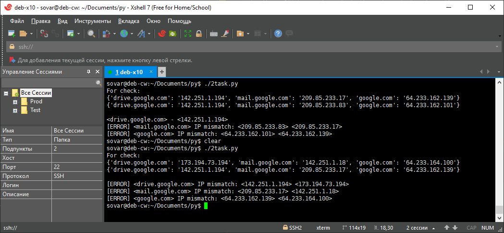

# Домашнее задание к занятию "4.1. Командная оболочка Bash: Практические навыки"

## Обязательная задача 1

Есть скрипт:
```bash
a=1
b=2
c=a+b
d=$a+$b
e=$(($a+$b))
```

Какие значения переменным c,d,e будут присвоены? Почему?

| Переменная  | Значение | Обоснование |
| ------------- | ------------- | ------------- |
| `c`  | a+b  | строковая переменная, которую определили, как a+b |
| `d`  | 1+2  | строковая переменная, a и b неявно определенные целочисленные переменные, поэтому bash будет выполнять сложение двух строк |
| `e`  | 3  | целочисленная переменная, в рамках синтаксиса, если мы хотим провести арифметическую операцию, необходимо обернуть переменные в скобки (()) |


## Обязательная задача 2
На нашем локальном сервере упал сервис и мы написали скрипт, который постоянно проверяет его доступность, записывая дату проверок до тех пор, пока сервис не станет доступным (после чего скрипт должен завершиться). В скрипте допущена ошибка, из-за которой выполнение не может завершиться, при этом место на Жёстком Диске постоянно уменьшается. Что необходимо сделать, чтобы его исправить:
```bash
while ((1==1)
do
	curl https://localhost:4757
	if (($? != 0))
	then
		date >> curl.log
	fi
done
```
### Исправленный скрипт
```bash
#!/usr/bin/env bash
while ((1==1))
do
    curl https://localhost:4757
    if (($? != 0))
    then
        date >> curl.log
    else 
        break
    fi
done
```


## Обязательная задача 3
Необходимо написать скрипт, который проверяет доступность трёх IP: `192.168.0.1`, `173.194.222.113`, `87.250.250.242` по `80` порту и записывает результат в файл `log`. Проверять доступность необходимо пять раз для каждого узла.

### Ваш скрипт:
```bash
#!/usr/bin/env bash

mass_ip=(192.168.0.1 173.194.222.113 87.250.250.242)
mass_index=(1 2 3 4 5)

for n in ${mass_index[@]}
do
    for i in ${mass_ip[@]}
    do
      curl $i:80 > /dev/null 2>&1
      if (($? == 0))
          then
              echo "$i 80 port available" >> ~/script/file.log
          else
              echo "$i 80 port deny" >> ~/script/file.log
      fi
    done
done
```

## Обязательная задача 4
Необходимо дописать скрипт из предыдущего задания так, чтобы он выполнялся до тех пор, пока один из узлов не окажется недоступным. Если любой из узлов недоступен - IP этого узла пишется в файл error, скрипт прерывается.

### Ваш скрипт:
```bash
#!/usr/bin/env bash

mass_ip=(192.168.0.1 173.194.222.113 87.250.250.242)

while ((1 == 1))
do
    for i in ${mass_ip[@]}
    do
        curl $i:80 > /dev/null 2>&1
        if (($? != 0))
                then
                    echo "$i 80 port deny" >> ~/script/file.log
                    exit
        fi
    done
done
```

## Задание - 3.9 Элементы безопасности информационных систем

> 1. Установите Bitwarden плагин для браузера. Зарегестрируйтесь и сохраните несколько паролей.

Ответ:

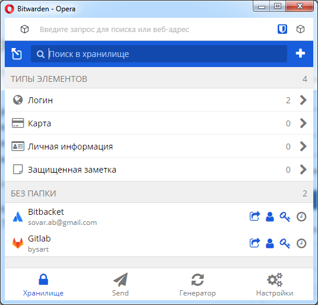

> 2. Установите Google authenticator на мобильный телефон. Настройте вход в Bitwarden акаунт через Google authenticator OTP.

Ответ:

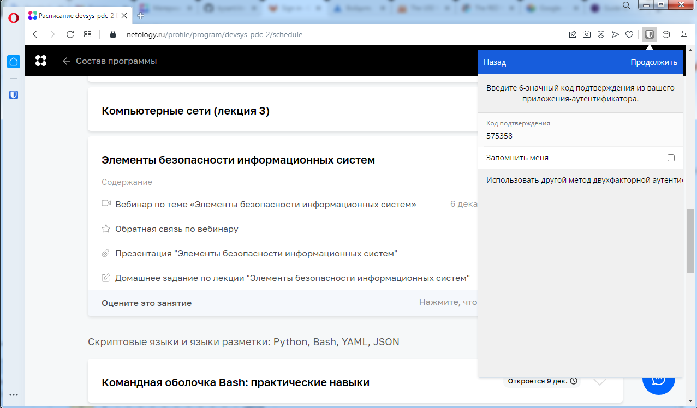

> 3. Установите apache2, сгенерируйте самоподписанный сертификат, настройте тестовый сайт для работы по HTTPS.

Ответ:
```
sudo openssl req -x509 -nodes -days 356 -newkey rsa:2048 -keyout /etc/ssl/private/apache-selfsigned.key -out /etc/ssl/certs/apache-selfsigned.crt -subj "/C=RU/ST=Saint-Petersburg/L=Saint-Petersburg/O=MyNet Name/OU=Org/CN=my-comp.ru"
Generating a RSA private key
................................+++++
........................+++++
writing new private key to '/etc/ssl/private/apache-selfsigned.key'
-----
```
В данном случае используется самосгенерированный сертификат, не от удостоверяющего центра.
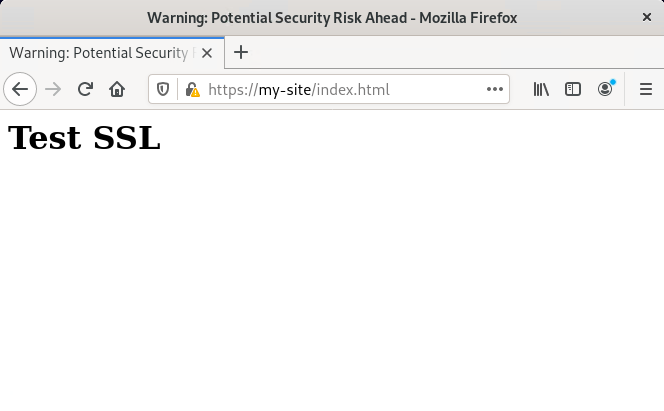

> 4. Проверьте на TLS уязвимости произвольный сайт в интернете.

Ответ:
```
[sovar@spb-svc github]$ ./testssl.sh/testssl.sh -U --sneaky https://en.wikipedia.org/

###########################################################
    testssl.sh       3.1dev from https://testssl.sh/dev/

      This program is free software. Distribution and
             modification under GPLv2 permitted.
      USAGE w/o ANY WARRANTY. USE IT AT YOUR OWN RISK!

       Please file bugs @ https://testssl.sh/bugs/

###########################################################

 Using "OpenSSL 1.0.2-chacha (1.0.2k-dev)" [~179 ciphers]
 on spb-svc:./testssl.sh/bin/openssl.Linux.x86_64
 (built: "Jan 18 17:12:17 2019", platform: "linux-x86_64")


 Start 2021-12-08 15:13:22        -->> 91.198.174.192:443 (en.wikipedia.org) <<--

 Further IP addresses:   2620:0:862:ed1a::1 
 rDNS (91.198.174.192):  text-lb.esams.wikimedia.org.
 Service detected:       HTTP


 Testing vulnerabilities 

 Heartbleed (CVE-2014-0160)                not vulnerable (OK), no heartbeat extension
 CCS (CVE-2014-0224)                       not vulnerable (OK)
 Ticketbleed (CVE-2016-9244), experiment.  not vulnerable (OK)
 ROBOT                                     Server does not support any cipher suites that use RSA key transport
 Secure Renegotiation (RFC 5746)           supported (OK)
 Secure Client-Initiated Renegotiation     not vulnerable (OK)
 CRIME, TLS (CVE-2012-4929)                not vulnerable (OK)
 BREACH (CVE-2013-3587)                    no gzip/deflate/compress/br HTTP compression (OK)  - only supplied "/" tested
 POODLE, SSL (CVE-2014-3566)               not vulnerable (OK)
 TLS_FALLBACK_SCSV (RFC 7507)              No fallback possible (OK), no protocol below TLS 1.2 offered
 SWEET32 (CVE-2016-2183, CVE-2016-6329)    not vulnerable (OK)
 FREAK (CVE-2015-0204)                     not vulnerable (OK)
 DROWN (CVE-2016-0800, CVE-2016-0703)      not vulnerable on this host and port (OK)
                                           make sure you don't use this certificate elsewhere with SSLv2 enabled services
                                           https://censys.io/ipv4?q=488ABE61E7804EF26974DF1FB95B5ACA7FFECC7B17BD8BD7BA89D4CF99169ECA could help you to find out
 LOGJAM (CVE-2015-4000), experimental      not vulnerable (OK): no DH EXPORT ciphers, no DH key detected with <= TLS 1.2
 BEAST (CVE-2011-3389)                     not vulnerable (OK), no SSL3 or TLS1
 LUCKY13 (CVE-2013-0169), experimental     not vulnerable (OK)
 Winshock (CVE-2014-6321), experimental    not vulnerable (OK)
 RC4 (CVE-2013-2566, CVE-2015-2808)        no RC4 ciphers detected (OK)


 Done 2021-12-08 15:15:55 [ 160s] -->> 91.198.174.192:443 (en.wikipedia.org) <<--
```

> 5. Установите на Ubuntu ssh сервер, сгенерируйте новый приватный ключ. Скопируйте свой публичный ключ на другой сервер. Подключитесь к серверу по SSH-ключу.

Ответ:
Выполнял для Debian.
```
sovar@deb-cw:~$ cat ~/.ssh/id_rsa.pub 
ssh-rsa ХХХХB3NzaC1yc2EХХХХХAQABAAABgQDB07feXAqG/2SQ2r7ytabCqWekwItGY23Zrk3Rxh1wFbwEeCu/LmT1BiCXaiDXJoexuYCH++2Ar2ZcXl5yA1ost+z+KLf/RL40JjCvnE1W+wraUnyCVxpqWBtUrbMm6nVW7Zl7lc8HF/w0SVjeiZLXwJjJI0h60Qr3TgjjQEtfwNvPDvaU7XPRhyHAplG0D7zhCT/x2X4nGXL7QAtme56STc09zTjXiFKwn12oraVc2fR0uLoDPJzMLCfMkVVHx3Rz39l5KpwAcTcX7f+zS10+Le1eRnx+orsTaDkFvL429uDzmRM0YtcD5vhlBKtPH9uFNzz7jVZJkWBJH4Bd9yTOaR1IsrZCVM/cxgVEwZFKGU/YH+jKdmANj2sE0G3D3dH8EcrtXrexsj2CaXvuvECfFH/WcvuLUrIxnu5icwz3+GcHeXiDUp/uSbr50uhGE1sdAYm5afRy2LU4Sjx5Z6GtiACcWR18FaAv/lGM58gMEHPJlCM02eAdK+pnkEyweNk= sovar@deb-cw
```
```
sovar@deb-cw:~$ ssh-copy-id sovar@10.ХХХ.ХХХ.ХХХ
/usr/bin/ssh-copy-id: INFO: Source of key(s) to be installed: "/home/sovar/.ssh/id_rsa.pub"
The authenticity of host '10.ХХХ.ХХХ.ХХХ (10.ХХХ.ХХХ.ХХХ)' can't be established.
ECDSA key fingerprint is SHA256:gVYFAiKbeLs1r4sSgYBukjZ6uWby56jm8BlKzzdJEmo.
Are you sure you want to continue connecting (yes/no/[fingerprint])? y
Please type 'yes', 'no' or the fingerprint: yes
/usr/bin/ssh-copy-id: INFO: attempting to log in with the new key(s), to filter out any that are already installed
/usr/bin/ssh-copy-id: INFO: 1 key(s) remain to be installed -- if you are prompted now it is to install the new keys
sovar@10.ХХХ.ХХХ.ХХХ's password: 

Number of key(s) added: 1

Now try logging into the machine, with:   "ssh 'sovar@10.ХХХ.ХХХ.ХХХ'"
and check to make sure that only the key(s) you wanted were added.
```
```
sovar@deb-cw:~$ ssh sovar@10.ХХХ.ХХХ.ХХХ
Enter passphrase for key '/home/sovar/.ssh/id_rsa': 
Linux prom-graf 5.10.0-9-amd64 #1 SMP Debian 5.10.70-1 (2021-09-30) x86_64

The programs included with the Debian GNU/Linux system are free software;
the exact distribution terms for each program are described in the
individual files in /usr/share/doc/*/copyright.

Debian GNU/Linux comes with ABSOLUTELY NO WARRANTY, to the extent
permitted by applicable law.
Last login: Thu Dec  9 11:05:16 2021 from 10.ХХХ.ХХХ.ХХХ
sovar@prom-graf:~$ 
```

> 6. Переименуйте файлы ключей из задания 5. Настройте файл конфигурации SSH клиента, так чтобы вход на удаленный сервер осуществлялся по имени сервера.

Ответ:
```
sovar@deb-cw:~$ cat .ssh/config 
Host prom_graf
	HostName 10.XXX.XXX.XXX
	User sovar
	IdentityFile ~/.ssh/prom_graf.key
```
```
sovar@deb-cw:~$ ssh prom_graf
The authenticity of host '10.ХХХ.ХХХ.ХХХ (10.ХХХ.ХХХ.ХХХ)' can't be established.
ECDSA key fingerprint is SHA256:gVYFAiKbeLs1r4sSgYBukjZ6uWby56jm8BlKzzdJEmo.
Are you sure you want to continue connecting (yes/no/[fingerprint])? yes
Warning: Permanently added '10.ХХХ.ХХХ.ХХХ' (ECDSA) to the list of known hosts.
Enter passphrase for key '/home/sovar/.ssh/prom_graf.key': 
Enter passphrase for key '/home/sovar/.ssh/prom_graf.key': 
Linux prom-graf 5.10.0-9-amd64 #1 SMP Debian 5.10.70-1 (2021-09-30) x86_64

The programs included with the Debian GNU/Linux system are free software;
the exact distribution terms for each program are described in the
individual files in /usr/share/doc/*/copyright.

Debian GNU/Linux comes with ABSOLUTELY NO WARRANTY, to the extent
permitted by applicable law.
Last login: Thu Dec  9 11:10:08 2021 from 10.ХХХ.ХХХ.ХХХ
```

> 7. Соберите дамп трафика утилитой tcpdump в формате pcap, 100 пакетов. Откройте файл pcap в Wireshark.

Ответ:
```
sovar@deb-cw:~$ sudo tcpdump -c 100 -w ~/tcpdump.pcap -i eth0
[sudo] password for sovar: 
tcpdump: listening on eth0, link-type EN10MB (Ethernet), snapshot length 262144 bytes
100 packets captured
101 packets received by filter
0 packets dropped by kernel
```
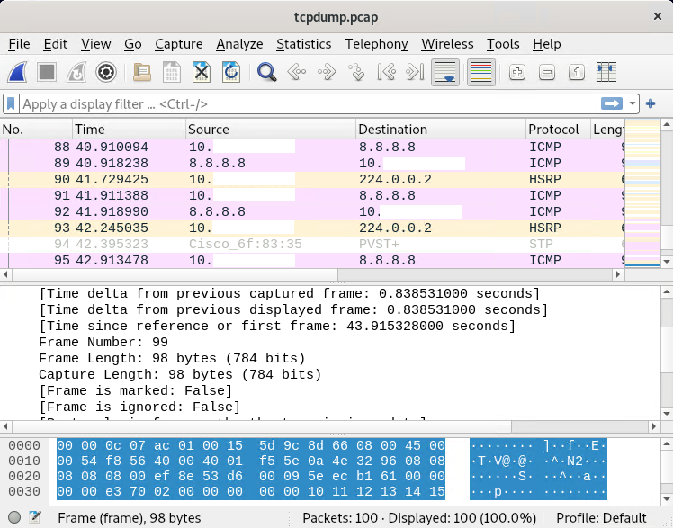

## Задание - 3.8 Компьютерные сети

> 1. Подключитесь к публичному маршрутизатору в интернет. Найдите маршрут к вашему публичному IP

Ответ:
`show ip route 95.161.ХХХ.ХХХ`
```
Routing entry for 95.161.240.0/20
  Known via "bgp 6447", distance 20, metric 0
  Tag 6939, type external
  Last update from 64.71.137.241 1d17h ago
  Routing Descriptor Blocks:
  * 64.71.137.241, from 64.71.137.241, 1d17h ago
      Route metric is 0, traffic share count is 1
      AS Hops 2
      Route tag 6939
      MPLS label: none
```

> 2. Создайте dummy0 интерфейс в Ubuntu. Добавьте несколько статических маршрутов. Проверьте таблицу маршрутизации.

Ответ:
```
cat /etc/network/interfaces
# This file describes the network interfaces available on your system
# and how to activate them. For more information, see interfaces(5).

source /etc/network/interfaces.d/*

# The loopback network interface
auto lo
iface lo inet loopback

# The primary network interface
allow-hotplug enp0s3
iface enp0s3 inet dhcp

allow-hotplug enp0s8
iface enp0s8 inet dhcp
post-up ip route add 10.0.0.0/8 dev enp0s8

allow-hotplug enp0s9
iface enp0s9 inet dhcp
post-up ip route add 191.168.56.0/24 dev dummy0

auto dummy0
iface dummy0 inet static
address 10.0.0.1/32
pre-up ip link add dummy0 type dummy
post-down ip link del dummy0
```
```
sovar@deb-v1:~$ ip -br route
default via 10.0.3.2 dev enp0s8
10.0.0.0/8 dev enp0s8 scope link
10.0.3.0/24 dev enp0s8 proto kernel scope link src 10.0.3.15
191.168.56.0/24 dev dummy0 scope link
192.168.56.0/24 dev enp0s3 proto kernel scope link src 192.168.56.101
192.168.56.0/24 dev enp0s9 proto kernel scope link src 192.168.56.102
```

> 3. Проверьте открытые TCP порты в Ubuntu, какие протоколы и приложения используют эти порты? Приведите несколько примеров.

Ответ:
Под рукой не оказалось Ubuntu, есть Debian, привожу выкладку с него.
```
sovar@deb-v1:~$ ss -ta
State               Recv-Q              Send-Q                              Local Address:Port                             Peer Address:Port
LISTEN              0                   128                                       0.0.0.0:ssh                                   0.0.0.0:*
ESTAB               0                   64                                 192.168.56.101:ssh                              192.168.56.1:49862
LISTEN              0                   128                                          [::]:ssh                                      [::]:*
```

> 4. Проверьте используемые UDP сокеты в Ubuntu, какие протоколы и приложения используют эти порты?

Ответ: 
На текущий моменет в системе нет используемых UDP сокетов.
```
sovar@deb-v1:~$ ss -ua
State               Recv-Q              Send-Q                             Local Address:Port                               Peer Address:Port
UNCONN              0                   0                                        0.0.0.0:bootpc                                  0.0.0.0:*
UNCONN              0                   0                                        0.0.0.0:bootpc                                  0.0.0.0:*
UNCONN              0                   0                                        0.0.0.0:bootpc                                  0.0.0.0:*
```


> 5. Используя diagrams.net, создайте L3 диаграмму вашей домашней сети или любой другой сети, с которой вы работали.

Ответ:

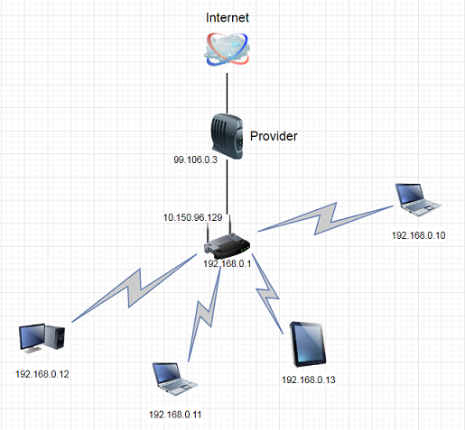

## Задание - 3.7 Компьютерные сети

> 1. Проверьте список доступных сетевых интерфейсов на вашем компьютере. Какие команды есть для этого в Linux и в Windows?

Ответ:

Windows: `ipconfig /all`;
Linux (Debian): `ip addr`, в том числе можно посмотреть файл `/etc/network/interfaces`, стоит отметить, что файл конфигурации интерфейсов может отличатся, все зависит от дистрибутива.

> 2. Какой протокол используется для распознавания соседа по сетевому интерфейсу? Какой пакет и команды есть в Linux для этого? 

Ответ:
Протокол - LLDP, lldpd - пакет, `lldpctl` - показывает соседние объекты.

> 3. Какая технология используется для разделения L2 коммутатора на несколько виртуальных сетей? Какой пакет и команды есть в Linux для этого? Приведите пример конфига.

Ответ:
Vlan - виртуальные сети. vlan - пакет, для определения принадлежности интерфейса к конкретному vlan необходимо внести изменения в `/etc/network/interfaces`, существует два типа записи `enp0s3.()` , `vlan()` (указывается номер vlan, например 100).

> 4. Какие типы агрегации интерфейсов есть в Linux? Какие опции есть для балансировки нагрузки? Приведите пример конфига.

Ответ:

Типы агрегации:
- balance-rr
- active-backup
- balance-xor
- broadcast
- 802.3ad
- balance-tlb
- balance-alb

Для балансировки нагрузки необходимо прописать следующие mode:
- 0 значение по умолчанию round-robin
- 2 распределение пакетов по интерфейсам по формуле XOR
- 5 адаптивная балансировка нагрузки, исходящий трафик распределяется исходя из загрузки интерфейсов
- 6 адаптивная балансировка, балансировка как in, так и out трафика

```
auto bond0

iface bond0 inet static
    address 192.168.56.110
    netmask 255.255.255.0
    network 192.168.56.0
    gateway 192.168.56.254
    bond-slaves enp0s3 enp0s9
    bond-mode active-backup
    bond-miimon 100
    bond-downdelay 200
    bond-updelay 200
```
> 5. Сколько IP адресов в сети с маской /29 ? Сколько /29 подсетей можно получить из сети с маской /24. Приведите несколько примеров /29 подсетей внутри сети 10.10.10.0/24.

Ответ:
6 IP адресов в сети с маской 29, в сети с маской 24 можно выделить 32 подсети: 10.10.10.0/29; 	10.10.10.8/29; 10.10.10.16/29.

> 6. Задача: вас попросили организовать стык между 2-мя организациями. Диапазоны 10.0.0.0/8, 172.16.0.0/12, 192.168.0.0/16 уже заняты. Из какой подсети допустимо взять частные IP адреса? Маску выберите из расчета максимум 40-50 хостов внутри подсети.

Ответ:
100.64.0.0/10 - частная подсеть (Carrier-Grade NAT). Взял бы подсеть 100.64.0.0/26 - 62 доступных хоста, подсеть 100.64.0.0/27 - 30 хостов, что явно мало, 100.64.0.0/25 - 126 хостов, является избыточной подсетью для нашей задачи. 

> 7. Как проверить ARP таблицу в Linux, Windows? Как очистить ARP кеш полностью? Как из ARP таблицы удалить только один нужный IP?

Ответ:

Windows: просмотр ARP таблицы `arp -a`, очистка кеша `arp -d`, удалить только необходимы IP `arp -d xxx.xxx.xxx.xxx` (вместо xxx указать конкретный IP);
Linux (Debian): просмотр ARP таблицы `arp`, можно использовать ключи -e (вывод более удобен для чтения, отображается колонками), -a (вывод без колонок), удаление записи `arp -d xxx.xxx.xxx.xxx` (вместо xxx указать конкретный IP), очистка всего кеша `ip neigh flush all`, arp не чистит весь кеш, только записи; для удаления записисей в кеш необходимы права root.

## Задание - 3.6 Компьютерные сети

> 1. Работа c HTTP через телнет. Подключитесь утилитой телнет к сайту stackoverflow.com telnet stackoverflow.com 80, отправьте HTTP запрос. В ответе укажите полученный HTTP код, что он означает?

Ответ:
Получил от сервера ответ 302 Moved Temporarily, что означает ресурс переехал, в том числе сервер отдает headers, body в ответе отсутствует или пустой.
```
HTTP/1.0 302 Moved Temporarily
Location: https://151.101.129.69:6081/php/uid.php?vsys=1&rule=2&url=http://151.101.129.69%2fquestions
Content-Length: 0
Pragma: no-cache
Cache-Control: no-cache
```

> 2. Повторите задание 1 в браузере, используя консоль разработчика F12.

Ответ:


Время загрузки страницы составило 343ms, запрос GET https://stackoverflow.com/ обрабатывался дольше всего:


 
> 3. Какой IP адрес у вас в интернете?

Ответ:
Через сайт https://whoer.net/ узнал IP: 80.248.ХХХ.ХХХ

> 4. Какому провайдеру принадлежит ваш IP адрес? Какой автономной системе AS? Воспользуйтесь утилитой whois.

Ответ:
`whois 80.248.XXX.XXX`, провайдер: Rostelecom, AS: AS8997

> 5. Через какие сети проходит пакет, отправленный с вашего компьютера на адрес 8.8.8.8? Через какие AS? Воспользуйтесь утилитой traceroute

Ответ:
```
[sovar@spb-svc ~]$ traceroute -An 8.8.8.8
traceroute to 8.8.8.8 (8.8.8.8), 30 hops max, 60 byte packets
 1  10.ХХХ.ХХХ.ХХХ [*]  1.106 ms  1.407 ms  1.636 ms
 2  192.ХХХ.ХХХ.ХХХ [*]  2.242 ms  2.187 ms  2.135 ms
 3  80.248.ХХХ.ХХХ [AS12380]  4.702 ms  4.649 ms  4.597 ms
 4  212.48.ХХХ.ХХХ [AS12389]  2.566 ms  2.511 ms 212.48.204.190 [AS12389]  3.136 ms
 5  188.254.2.4 [AS12389]  3.090 ms  6.932 ms 188.254.2.6 [AS12389]  7.495 ms
 6  87.226.194.47 [AS12389]  6.766 ms  4.581 ms  5.465 ms
 7  74.125.244.133 [AS15169]  8.124 ms  6.627 ms 74.125.244.181 [AS15169]  7.181 ms
 8  72.14.232.84 [AS15169]  16.508 ms 142.251.61.221 [AS15169]  10.593 ms 72.14.232.84 [AS15169]  7.045 ms
 9  142.250.56.13 [AS15169]  6.964 ms 216.239.63.25 [AS15169]  12.367 ms 216.239.48.163 [AS15169]  11.007 ms
10  172.253.51.239 [AS15169]  12.927 ms * 142.250.56.215 [AS15169]  16.078 ms
11  * * *
12  * * *
13  * * *
14  * * *
15  * * *
16  * * *
17  * * *
18  * * *
19  8.8.8.8 [AS15169]  9.212 ms * *
```

> 6. Повторите задание 5 в утилите mtr. На каком участке наибольшая задержка - delay?

Ответ:
Судя по среднему показателю наибольшие задержки на 9 участке. 
```
 	My traceroute  [v0.94]
spb-svc (10.ХХХ.ХХХ.ХХХ) -> 8.8.8.8 (8.8.8.8)        2021-11-30T10:45:01+0300
Keys:  Help   Display mode   Restart statistics   Order of fields   quit
                                  Packets               Pings
 Host                           Loss%   Snt   Last   Avg  Best  Wrst StDev
 1. AS???    10.ХХХ.ХХХ.ХХХ        0.0%    71    2.3   4.4   1.1  31.7   5.0
 2. AS???    192.ХХХ.ХХХ.ХХХ       0.0%    71    1.0   1.1   0.8   1.5   0.2
 3. AS12380  80.248.ХХХ.ХХХ      0.0%    71    3.4   4.2   1.4  17.0   3.6
 4. AS12389  212.48.ХХХ.ХХХ      0.0%    71    7.1   3.8   1.4  16.4   3.6
 5. AS12389  188.254.2.6         0.0%    71    4.2   4.9   4.0  19.8   2.6
 6. AS12389  87.226.194.47       0.0%    70    8.3   9.0   5.9 163.3  18.8
 7. AS15169  74.125.244.181      0.0%    70    9.6   7.4   6.0  28.0   2.9
 8. AS15169  142.251.51.187      0.0%    70   28.1  12.0   7.7 109.3  13.1
 9. AS15169  172.253.70.51       0.0%    70   12.1  13.5  11.3  57.0   5.6
10. (waiting for reply)
11. (waiting for reply)
12. (waiting for reply)
13. (waiting for reply)
14. (waiting for reply)
15. (waiting for reply)
16. (waiting for reply)
17. (waiting for reply)
18. AS15169  8.8.8.8            95.7%    70    7.6   7.5   7.4   7.6   0.1
```

> 7. Какие DNS сервера отвечают за доменное имя dns.google? Какие A записи? воспользуйтесь утилитой dig

Ответ:
```
dns.google.		3553	IN	NS	ns1.zdns.google.
dns.google.		3553	IN	NS	ns2.zdns.google.
dns.google.		3553	IN	NS	ns3.zdns.google.
dns.google.		3553	IN	NS	ns4.zdns.google.
```
```
dns.google.		256	IN	A	8.8.4.4
dns.google.		256	IN	A	8.8.8.8
```

> 8. Проверьте PTR записи для IP адресов из задания 7. Какое доменное имя привязано к IP? воспользуйтесь утилитой dig

Ответ: 
```
8.8.8.8.in-addr.arpa.	5518	IN	PTR	dns.google.
4.4.8.8.in-addr.arpa.	53671	IN	PTR	dns.google.
```

## Задание - 3.5 Файловые системы

> 1. Узнайте о sparse (разряженных) файлах.

Ответ:
Разреженный файл - файл, в котором последовательность нулевых байтов заменена на информацию об этих последовательностях. По факту можно считать методом сжатия данных на уровне файловой системы. Есть свои преимущества и недостатки.

> 2. Могут ли файлы, являющиеся жесткой ссылкой на один объект, иметь разные права доступа и владельца? Почему?

Ответ:
Нет, не могут. HL (Hard Link) - является идентичными по отношению к объекту, на которые они указывают, inode у них будет один и тот же, в inode записываются метаданные, в том числе и права доступа, поэтому нельзя установить разные права и владельца, в отличии от symlink.

> 3. Сделайте vagrant destroy на имеющийся инстанс Ubuntu. Замените содержимое Vagrantfile. Данная конфигурация создаст новую виртуальную машину с двумя дополнительными неразмеченными дисками по 2.5 Гб.

Ответ: 


> 4. Используя fdisk, разбейте первый диск на 2 раздела: 2 Гб, оставшееся пространство.

Ответ:


> 5. Используя sfdisk, перенесите данную таблицу разделов на второй диск.

Ответ:


> 6. Соберите mdadm RAID1 на паре разделов 2 Гб.

Ответ:


> 7. Соберите mdadm RAID0 на второй паре маленьких разделов. 

Ответ:


> 8. Создайте 2 независимых PV на получившихся md-устройствах.

Ответ:
Создавал через LVM tool, хотя можно было и командами. Общий скрин ниже

> 9. Создайте общую volume-group на этих двух PV.

Ответ:
Создавал через LVM tool, хотя можно было и командами. Общий скрин ниже

> 10. Создайте LV размером 100 Мб, указав его расположение на PV с RAID0.

Ответ:


> 11. Создайте mkfs.ext4 ФС на получившемся LV.

Ответ:
`mkfs.ext4 /dev/vg1_md/lv1`

> 12. Смонтируйте этот раздел в любую директорию, например, /tmp/new.

Ответ:
`mount /dev/vg1_md/lv1 /tmp/new/`. В том числе необходимо добавить данные в /etc/fstab, если есть потребность монтировать LV на постоянную основу. Без внесения данных в /etc/fstab, после ребута LV не будет примонтирован в /tmp/new

> 13. Поместите туда тестовый файл, например wget https://mirror.yandex.ru/ubuntu/ls-lR.gz -O /tmp/new/test.gz.

Ответ:
```
--2021-11-24 20:49:11--  https://mirror.yandex.ru/ubuntu/ls-lR.gz
Resolving mirror.yandex.ru (mirror.yandex.ru)... 213.180.204.183, 2a02:6b8::183
Connecting to mirror.yandex.ru (mirror.yandex.ru)|213.180.204.183|:443... connected.
HTTP request sent, awaiting response... 200 OK
Length: 22565143 (22M) [application/octet-stream]
Saving to: ‘/tmp/new/test.gz’

/tmp/new/test.gz            100%[===========================================>]  21.52M  5.36MB/s    in 4.1s
```

> 14. Прикрепите вывод lsblk.

Ответ:


> 15. Протестируйте целостность файла:

Ответ:
 `md5sum /tmp/new/test.gz`

> 16. Используя pvmove, переместите содержимое PV с RAID0 на RAID1.

Ответ:


> 17. Сделайте --fail на устройство в вашем RAID1 md.

Ответ:
`mdadm /dev/md1 --fail /dev/sdb1`

> 18. Подтвердите выводом dmesg, что RAID1 работает в деградированном состоянии.

Ответ:
```
dmesg | grep md1
[ 8343.259667] md/raid1:md1: Disk failure on sdb1, disabling device.
               md/raid1:md1: Operation continuing on 1 devices.
```

> 19. Протестируйте целостность файла, несмотря на "сбойный" диск он должен продолжать быть доступен:

Ответ:
```
root@vagrant:~# md5sum /tmp/new/test.gz
f12adc4f6c317abad7ae9d8ec49d2ed2  /tmp/new/test.gz
root@vagrant:~# echo $?
0
```

> 20. Погасите тестовый хост, vagrant destroy.

Ответ:
```
sovar@iMACPC MINGW64 /c/DATA/Private/FED/DevOps/course/vagrant
$ vagrant destroy
    default: Are you sure you want to destroy the 'default' VM? [y/N] y
==> default: Forcing shutdown of VM...
==> default: Destroying VM and associated drives...
```

## Задание - 3.4 Операционные системы

> 1. На лекции мы познакомились с node_exporter. В демонстрации его исполняемый файл запускался в background. Этого достаточно для демо, но не для настоящей production-системы, где процессы должны находиться под внешним управлением. Используя знания из лекции по systemd, создайте самостоятельно простой unit-файл для node_exporter.

Ответ:
- `sudo systemctl enable --now node_exporter.service`;
```
[Unit]
Descriotion=Node_Exporter/Prometheus - monitoring host metrics

[Service]
Type=simple
EnvironmentFile=-/etc/default/node_exporter
ExecStart=/home/vagrant/node_exporter-1.3.0.linux-amd64/node_exporter
Restart=always

[Install]
WantedBy=multi-user.target
```
- `systemctl status node_exporter`; через systemctl stop start проверяю работу сервиса, в качестве доп. проверки `curl http://localhost:9100/metrics`
```
vagrant@vagrant:~$ systemctl status node_exporter
● node_exporter.service
     Loaded: loaded (/etc/systemd/system/node_exporter.service; enabled; vendor preset: enabled)
     Active: active (running) since Sun 2021-11-21 18:23:43 UTC; 1s ago
   Main PID: 1061 (node_exporter)
      Tasks: 5 (limit: 2319)
     Memory: 2.5M
     CGroup: /system.slice/node_exporter.service
             └─1061 /home/vagrant/node_exporter-1.3.0.linux-amd64/node_exporter

Nov 21 18:23:43 vagrant node_exporter[1061]: ts=2021-11-21T18:23:43.822Z caller=node_exporter.go:115 level=info collector=thermal_zone
Nov 21 18:23:43 vagrant node_exporter[1061]: ts=2021-11-21T18:23:43.822Z caller=node_exporter.go:115 level=info collector=time
Nov 21 18:23:43 vagrant node_exporter[1061]: ts=2021-11-21T18:23:43.822Z caller=node_exporter.go:115 level=info collector=timex
Nov 21 18:23:43 vagrant node_exporter[1061]: ts=2021-11-21T18:23:43.822Z caller=node_exporter.go:115 level=info collector=udp_queues
Nov 21 18:23:43 vagrant node_exporter[1061]: ts=2021-11-21T18:23:43.822Z caller=node_exporter.go:115 level=info collector=uname
Nov 21 18:23:43 vagrant node_exporter[1061]: ts=2021-11-21T18:23:43.822Z caller=node_exporter.go:115 level=info collector=vmstat
Nov 21 18:23:43 vagrant node_exporter[1061]: ts=2021-11-21T18:23:43.822Z caller=node_exporter.go:115 level=info collector=xfs
Nov 21 18:23:43 vagrant node_exporter[1061]: ts=2021-11-21T18:23:43.822Z caller=node_exporter.go:115 level=info collector=zfs
Nov 21 18:23:43 vagrant node_exporter[1061]: ts=2021-11-21T18:23:43.822Z caller=node_exporter.go:199 level=info msg="Listening on" address=:9100
Nov 21 18:23:43 vagrant node_exporter[1061]: ts=2021-11-21T18:23:43.823Z caller=tls_config.go:195 level=info msg="TLS is disabled." http2=false
```

> 2. Ознакомьтесь с опциями node_exporter и выводом /metrics по-умолчанию. Приведите несколько опций, которые вы бы выбрали для базового мониторинга хоста по CPU, памяти, диску и сети.

Ответ: в рамках отображения метрик на базе графаны есть уже готовый дашборд 1860 by rfraile. Так как разговор идет о мониторинге performence, скорее всего данный сбор аналитики будет достаточным. Однако всегда есть возможность тонкой настройки под себя, к примеру есть следующие метрки:
- CPU: node_cpu_seconds_total - общая загрузка CPU в секунду в разных режимах.
- MEM: go_memstats_alloc_bytes_total - общее кол-во выделенной памяти в байтах
- HDD: node_disk_io_time_seconds_total - общее затраченное время на input|output
- ETH: node_network_up - в up ли сетевой интерфейс

> 3. Установите в свою виртуальную машину Netdata. Воспользуйтесь готовыми пакетами для установки (sudo apt install -y netdata). После успешной перезагрузки в браузере на своем ПК (не в виртуальной машине) вы должны суметь зайти на localhost:19999. Ознакомьтесь с метриками, которые по умолчанию собираются Netdata и с комментариями, которые даны к этим метрикам.

Ответ:


> 4. Можно ли по выводу dmesg понять, осознает ли ОС, что загружена не на настоящем оборудовании, а на системе виртуализации?

Ответ: да, можно
```
[    0.000000] DMI: innotek GmbH VirtualBox/VirtualBox, BIOS VirtualBox 12/01/2006
[    0.000000] Hypervisor detected: KVM
[    0.107494] Booting paravirtualized kernel on KVM
```

> 5. Как настроен sysctl fs.nr_open на системе по-умолчанию? Узнайте, что означает этот параметр. Какой другой существующий лимит не позволит достичь такого числа (ulimit --help)?

Ответ:
fs.nr_open = 1048576. Это означает максимальное количество дескрипторов файлов, которое процесс может выделить, данный лимит зависит от лимита ресурсов RLIMIT_NOFILE. ulimit -Hn определение жесткого лимита.

> 6. Запустите любой долгоживущий процесс (не ls, который отработает мгновенно, а, например, sleep 1h) в отдельном неймспейсе процессов; покажите, что ваш процесс работает под PID 1 через nsenter. Для простоты работайте в данном задании под root (sudo -i). Под обычным пользователем требуются дополнительные опции (--map-root-user) и т.д.

Ответ:
```
root@vagrant:~# unshare -f --pid --mount-proc /usr/bin/sleep 1h

root@vagrant:~# nsenter --target 1708 --pid --mount
root@vagrant:/# ps aux
USER         PID %CPU %MEM    VSZ   RSS TTY      STAT START   TIME COMMAND
root           1  0.0  0.0   8076   532 pts/5    S    20:06   0:00 /usr/bin/sleep 1h
root          12  0.0  0.1   9836  4024 pts/5    S    20:09   0:00 -bash
root          21  0.0  0.1  11492  3356 pts/5    R+   20:09   0:00 ps aux
root@vagrant:/#

```

> 7. Найдите информацию о том, что такое :(){ :|:& };:. Запустите эту команду в своей виртуальной машине Vagrant с Ubuntu 20.04 (это важно, поведение в других ОС не проверялось). Некоторое время все будет "плохо", после чего (минуты) – ОС должна стабилизироваться. Вызов dmesg расскажет, какой механизм помог автоматической стабилизации. Как настроен этот механизм по-умолчанию, и как изменить число процессов, которое можно создать в сессии?

Ответ:
```
: ()
   {
	:|:&
} ; :
```
Функция, которая запускает сама себя два раза, те в свою очередь запускают еще два экземпляра функции и т.д. Чтобы ограничить число процессов необходимо: `ulimit -u n, где n кол-во процессов`. cgroup: fork rejected by pids controller in /user.slice/user-1000.slice/session-7.scope - механизм стабилизации. Группы управления, обычно называемые контрольными группами, представляют собой функцию ядра Linux, которая позволяет организовывать процессы в иерархические группы, использование различных типов ресурсов затем может быть ограничено и отслежено.

## Задание - 3.3 Операционные системы

> 1. Какой системный вызов делает команда cd? В прошлом ДЗ мы выяснили, что cd не является самостоятельной программой, это shell builtin, поэтому запустить strace непосредственно на cd не получится. Тем не менее, вы можете запустить strace на /bin/bash -c 'cd /tmp'. В этом случае вы увидите полный список системных вызовов, которые делает сам bash при старте. Вам нужно найти тот единственный, который относится именно к cd. Обратите внимание, что strace выдаёт результат своей работы в поток stderr, а не в stdout.

Ответ:
`chdir("/tmp")` - системный вызов chdir: изменяет текущий рабочий каталог вызвавшего процесса на каталог, указанный в path.

> 2. Попробуйте использовать команду file на объекты разных типов на файловой системе. Используя strace выясните, где находится база данных file на основании которой она делает свои догадки.

Ответ:
`openat(AT_FDCWD, "/usr/share/misc/magic.mgc", O_RDONLY) = 3`
`/usr/share/misc/magic.mgc` - файл определения типов для команды file. File позволяет определить тип файла посредством проверки соответствия начальных символов файла определенному "магическому" числу (помимо прочих проверок). В файле /usr/share/misc/magic указаны "магические" числа для проверки, сообщение, которое будет выведено в случае обнаружения конкретного "магического" числа, а также дополнительная информация, извлекаемая из файла.

> 3. Предположим, приложение пишет лог в текстовый файл. Этот файл оказался удален (deleted в lsof), однако возможности сигналом сказать приложению переоткрыть файлы или просто перезапустить приложение – нет. Так как приложение продолжает писать в удаленный файл, место на диске постепенно заканчивается. Основываясь на знаниях о перенаправлении потоков предложите способ обнуления открытого удаленного файла (чтобы освободить место на файловой системе).

Ответ:
Через редактор vim открыл файл, swp удалил, получил вот такое состояние `vim  1631 vagrant 3u REG 253,0 12288 131081 /home/vagrant/.test.swp (deleted)`. При помощи команды `echo " " > /proc/1631/fd/3` - результат echo перенаправить в файл /proc/1631/fd/3, тем самым добился уменьшения файла.

> 4. Занимают ли зомби-процессы какие-то ресурсы в ОС (CPU, RAM, IO)?

Ответ:
Зомби процесс - дочерний процесс, который освобождает все ресурсы при завершении работы. Существует пока не обработается сигнал о завершении дочернего процесса родителем.

> 5. В iovisor BCC есть утилита opensnoop. На какие файлы вы увидели вызовы группы open за первую секунду работы утилиты? Воспользуйтесь пакетом bpfcc-tools для Ubuntu 20.04. Дополнительные сведения по установке.

Ответ:
```
PID    COMM               FD ERR PATH
616    irqbalance          6   0 /proc/interrupts
616    irqbalance          6   0 /proc/stat
616    irqbalance          6   0 /proc/irq/20/smp_affinity
616    irqbalance          6   0 /proc/irq/0/smp_affinity
616    irqbalance          6   0 /proc/irq/1/smp_affinity
616    irqbalance          6   0 /proc/irq/8/smp_affinity
616    irqbalance          6   0 /proc/irq/12/smp_affinity
616    irqbalance          6   0 /proc/irq/14/smp_affinity
616    irqbalance          6   0 /proc/irq/15/smp_affinity
```

> 6. Какой системный вызов использует uname -a? Приведите цитату из man по этому системному вызову, где описывается альтернативное местоположение в /proc, где можно узнать версию ядра и релиз ОС.

Ответ:
Системный вызов uname(). 
> Part of the utsname information is also accessible via /proc/sys/kernel/{ostype, hostname, osrelease, version, domainname}.

> 7. Чем отличается последовательность команд через ; и через && в bash? сть ли смысл использовать в bash &&, если применить set -e?

Ответ:
com1 ; com2 - будут выполнится последовательно com1, затем com2.
com1 && com2 - выполнить сначала com1, если успех - код возврата 0, то выполнить com2.
set -e будет перерывать выполнение, если код возврата выполнения команды не 0, в таком случае до com2 дело не дойдет, && смысла не имеет.

> 8. Из каких опций состоит режим bash set -euxo pipefail и почему его хорошо было бы использовать в сценариях?

Ответ: 
Следующие опции отвечают за:
 `-e` - немедленный выход, если программа вернула ненулевой код возарата.
 `-u` - при распарсивании команды неустановленные параметры и команды воспронимаются, как ошибки.
 `-x` - после парсинга команды показывает развернутое значение.
 `-o pipefail` - возвращаемое значение конвейера - это значение последней команды для выхода с ненулевым статусом или ноль, если все команды в конвейере завершаются успешно. По умолчанию эта опция отключена.
При неуспешном выполнении сценария, необбходимо больше информации, что пошло не так, данные параметры помогают нам получить больше информации для отладки.

> 9. Используя -o stat для ps, определите, какой наиболее часто встречающийся статус у процессов в системе. В man ps ознакомьтесь (/PROCESS STATE CODES) что значат дополнительные к основной заглавной буквы статуса процессов. Его можно не учитывать при расчете (считать S, Ss или Ssl равнозначными).

Ответ:
Ss, R+. В данном случае s и + - дополнительные символы. s - лидер сессии, + - находится в группе переднего плана.

## Задание - 3.2 Работа в терминале

> 1. Какого типа команда cd? Попробуйте объяснить, почему она именно такого типа; опишите ход своих мыслей, если считаете что она могла бы быть другого типа.

Ответ:
Команда cd является встроенной. Меняет директорию только в оболочке, в которой выполняется, использует переменные среды, выполняется без порождения дочернего процесса (fork). То есть, если бы команда была не встроена в интерпретатор (внешняя), то тогды бы создавался новый процесс, этот бы процесс наследовал каталог, в котором был создан родительский процесс и само изменение рабочего каталога не выполнялось бы.
 
> 2. Какая альтернатива без pipe команде grep <some_string> <some_file> | wc -l? man grep поможет в ответе на этот вопрос. Ознакомьтесь с документом о других подобных некорректных вариантах использования pipe.

Ответ:
`grep -c lorem test-file`

> 3. Какой процесс с PID 1 является родителем для всех процессов в вашей виртуальной машине Ubuntu 20.04?

Ответ:
systemd `pstree -p`

> 4. Как будет выглядеть команда, которая перенаправит вывод stderr ls на другую сессию терминала?

Ответ:
Команду запускаем в `/dev/pts/0` `ls - 2>/dev/pts/1`

> 5. Получится ли одновременно передать команде файл на stdin и вывести ее stdout в другой файл? Приведите работающий пример.

Ответ: 
`cat < test-file > test-file-stdout`

> 6. Получится ли находясь в графическом режиме, вывести данные из PTY в какой-либо из эмуляторов TTY? Сможете ли вы наблюдать выводимые данные?

Ответ: 
Вывести данные получится необходимо перенаправить stdout, однако наблюдать не получится, необходимо переключится в tty Ctrl-Alt-F1 

> 7. Выполните команду bash 5>&1. К чему она приведет? Что будет, если вы выполните echo netology > /proc/$$/fd/5? Почему так происходит?

Ответ: 
Определение FD 5, перенаправелнеие файлов с указанием FD 5 в stdout. Stdout echo перенаправляет в proc/$$/fd/5, а затем перенаправляется из файла 5 на stdout, тем самым выдается запись netology.

> 8. Получится ли в качестве входного потока для pipe использовать только stderr команды, не потеряв при этом отображение stdout на pty? Напоминаем: по умолчанию через pipe передается только stdout команды слева от | на stdin команды справа. Это можно сделать, поменяв стандартные потоки местами через промежуточный новый дескриптор, который вы научились создавать в предыдущем вопросе.

Ответ:
Да, получится `ls -123 3>&2 2>&1 1>&3 | wc -l`

> 9. Что выведет команда cat /proc/$$/environ? Как еще можно получить аналогичный по содержанию вывод?

Ответ:
Выдает массив значений переменного окружения, наследуются от родительского процесса. Команды printenv, env выводят значение переменного окружения.

> 10. Используя man, опишите что доступно по адресам /proc/<PID>/cmdline, /proc/<PID>/exe.

Ответ:
`/proc/<PID>/cmdline` - RO файл, полная командная строка для процесса, если последний не является зомби. Если процесс зомби, тогда чтение данного файла вернет 0. Аргументы командной строки появляются в этом файле как набор строк, разделенных нулевыми байтами. 
`/proc/<PID>/exe` - символическая ссылка, содержащая фактический путь к исполняемой команде. При попытке открыть файл будет запущен копия процесса. В более ранних версиях Linux (2.0 и младше) - указатель на двоичный файл. Вызов readlink для этого файла возвращает строку в формате [устройство]: индексный дескриптор.

> 11. Узнайте, какую наиболее старшую версию набора инструкций SSE поддерживает ваш процессор с помощью /proc/cpuinfo.

Ответ:
SSE4_2

> 12. При открытии нового окна терминала и vagrant ssh создается новая сессия и выделяется pty. Это можно подтвердить командой tty.....Почитайте, почему так происходит, и как изменить поведение.

Ответ:
При подключении к удаленному компьютеру по ssh tty не выделяется для сеанса по умолчанию, когда же из shell пытаемся запустить ssh, то скорее всего будет далее запущен первым shell и в таком случае tty выделяется, однако ssh ждет передачу user, а в данной команде его нет.
`ssh -t localhost 'tty'` -t принудительное открытие псевдотерминала.

> 13. Бывает, что есть необходимость переместить запущенный процесс из одной сессии в другую. Попробуйте сделать это, воспользовавшись reptyr. Например, так можно перенести в screen процесс, который вы запустили по ошибке в обычной SSH-сессии

Ответ: 
Выполнил. Необходимо установить значение `kernel.yama.ptrace_scope = 0`

> 14. sudo echo string > /root/new_file не даст выполнить перенаправление под обычным пользователем, так как перенаправлением занимается процесс shell'а, который запущен без sudo под вашим пользователем. Для решения данной проблемы можно использовать конструкцию echo string | sudo tee /root/new_file. Узнайте что делает команда tee и почему в отличие от sudo echo команда с sudo tee будет работать.

Ответ:
tee - читает из stdin и пишет stdout, файл. В данном pipeline  вывод в /root/new_file будет как раз выполняться из под sudo.


## Задание - 3.1 работа в терминале 

> 1. Установите средство виртуализации Oracle VirtualBox.

Установил.

> 2. Установите средство автоматизации Hashicorp Vagrant.

Установил.
Ошибок и проблем не наблюдал.

> 3. В вашем основном окружении подготовьте удобный для дальнейшей работы терминал. 

В поиске своего "любимого" терминала.
ДЗ выполняю в MINGW64.

> 4. С помощью базового файла конфигурации запустите Ubuntu 20.04 в VirtualBox посредством Vagrant

Выполнил.
`config.vm.box = "bento/ubuntu-20.04"`
Добавил в списпок to do - разобраться с синтаксисом файла Vagrantfile, изучить доки на оф сайте.

> 5. Ознакомьтесь с графическим интерфейсом VirtualBox, посмотрите как выглядит виртуальная машина, которую создал для вас Vagrant, какие аппаратные ресурсы ей выделены. Какие ресурсы выделены по-умолчанию?

Ответ:
RAM - 1 Gb
CPU - 2
HDD - скорее всего динамический тип, 64 Gb - size, 1,86 Gb - actual size
NET - 1 interface 1Gbit/s, NAT

> 6. Ознакомьтесь с возможностями конфигурации VirtualBox через Vagrantfile: документация. Как добавить оперативной памяти или ресурсов процессора виртуальной машине?

Ответ: 
Добавил 1 Gb RAM, 2 CPU
Для внесения изменений необходимо использовать провайдер VB.

Использовал:
Добавил в файл Vagrantfile:
```
config.vm.provider "virtualbox" do |v|
	v.name = "vagrant_ubuntu_20.04"
	v.memory = 2048
	v.cpus = 4
end
```
> 7. Команда vagrant ssh из директории, в которой содержится Vagrantfile, позволит вам оказаться внутри виртуальной машины без каких-либо дополнительных настроек. Попрактикуйтесь в выполнении обсуждаемых команд в терминале Ubuntu.

Выполнил.

> 8. Ознакомиться с разделами man bash, почитать о настройках самого bash:

- HISTFILESIZE - 681 строка
- не сохранять строки начинающиеся с символа пробел, не сохранять строки, совпадающие с последней выполненной командой

> 9. В каких сценариях использования применимы скобки {} и на какой строчке man bash это описано?

Ответ:
`{}` - зарезервированные слова, могут быть использованы для определения списка, для формирования состовных команд.
151 строка - упоминание о `{ }`, как зарезервированные слова
218 строка - `{ list; }`

> 10. С учётом ответа на предыдущий вопрос, как создать однократным вызовом touch 100000 файлов? Получится ли аналогичным образом создать 300000? Если нет, то почему?

Ответ:
`touch file{0..100000}`
300000 создать аналогично не получится, получим ошибку:
`-bash: /usr/bin/touch: Argument list too long` 
`touch file{0..300000}` будет распарсиваться в `touch file1 file2 file3 ...` строка ввода команды ограничена по размеру аргумента, создание 300000 файлов - в данной команде аргумент выходит за пределы максимальной длинны агрумента.

> 11. В man bash поищите по /\[\[. Что делает конструкция [[ -d /tmp ]]

Ответ:
Проверяет существует ли /tmp и является ли данный файл директорией, если существует и директории тогда возвращает 0.

> 12. Основываясь на знаниях о просмотре текущих (например, PATH) и установке новых переменных; командах, которые мы рассматривали, добейтесь в выводе type -a bash в виртуальной машине наличия первым пунктом в списке

Ответ:
```
mkdir -p /tmp/new_path_directory/bash 
cp /usr/bin/bash /tmp/new_path_directory/bash/
PATH=/tmp/new_path_directory/bash:$PATH
```

> 13. Чем отличается планирование команд с помощью batch и at?

Ответ: 
batch - выполнение команд, когда средняя загрузка системы падает ниже 1,5 или значения, указанного при вызове atd.
at - выполнение команд в указанное время.

## Задание - 2.4 git инструменты

Git содержит достаточно большое количество команд. Выполнение некоторых приводит к одному и тому же результату.

Для отработки навыков, постараюсь получить результат разными командами.

Самое основное, что нужно помнить всегда - все что необходимо уже содержится в man.

> 1. Найдите полный хеш и комментарий коммита, хеш которого начинается на aefea.

Ответ:
aefead2207ef7e2aa5dc81a34aedf0cad4c32545 Update CHANGELOG.md

Использовал:
`git show aefea`;
`git log --pretty=format:"%H , %s" | grep ^aefea`

> 2. Какому тегу соответствует коммит 85024d3?

Ответ:
v0.12.23

Использовал:
`git show 85024d3`;
`git tag --points-at 85024d3` 

> 3. Сколько родителей у коммита b8d720? Напишите их хеши.

Ответ:
- Par1: 56cd7859e05c36c06b56d013b55a252d0bb7e158
- Par2: 9ea88f22fc6269854151c571162c5bcf958bee2b

Использовал:
`git show b8d720^`;
`git show b8d720^2`

> 4. Перечислите хеши и комментарии всех коммитов которые были сделаны между тегами v0.12.23 и v0.12.24.

Ответ:
- b14b74c4939dcab573326f4e3ee2a62e23e12f89 [Website] vmc provider links
- 3f235065b9347a758efadc92295b540ee0a5e26e Update CHANGELOG.md
- 6ae64e247b332925b872447e9ce869657281c2bf registry: Fix panic when server is unreachable
- 5c619ca1baf2e21a155fcdb4c264cc9e24a2a353 website: Remove links to the getting started guide's old location
- 06275647e2b53d97d4f0a19a0fec11f6d69820b5 Update CHANGELOG.md
- d5f9411f5108260320064349b757f55c09bc4b80 command: Fix bug when using terraform login on Windows
- 4b6d06cc5dcb78af637bbb19c198faff37a066ed Update CHANGELOG.md
- dd01a35078f040ca984cdd349f18d0b67e486c35 Update CHANGELOG.md
- 225466bc3e5f35baa5d07197bbc079345b77525e Cleanup after v0.12.23 release

Использовал:
`git log v0.12.24...v0.12.23 --pretty=oneline`

> 5. Найдите коммит в котором была создана функция func providerSource, ее определение в коде выглядит так func providerSource(...) (вместо троеточего перечислены аргументы).

Ответ:
8c928e83589d90a031f811fae52a81be7153e82f

Использовал:
`git log -S "func providerSource("`

> 6. Найдите все коммиты в которых была изменена функция globalPluginDirs.

Ответ:
- 78b12205587fe839f10d946ea3fdc06719decb05
- 52dbf94834cb970b510f2fba853a5b49ad9b1a46
- 41ab0aef7a0fe030e84018973a64135b11abcd70
- 66ebff90cdfaa6938f26f908c7ebad8d547fea17

Использовал:
`git grep -e "globalPluginDirs("` - поиск файла где функция создается;
`git log -L :globalPluginDirs:plugins.go` поиск коммитов, в которых вносятся изменения в функцию.

> 7. Кто автор функции synchronizedWriters?

Ответ:
Martin Atkins <mart@degeneration.co.uk>

Использовал:
`git log -S "synchronizedWriters("` - поиск коммита, где создается функция;
`git show 5ac311e2a91e381e2f52234668b49ba670aa0fe5` - просмот информации о коммите.

## Задание - объяснить наполнение файла  .gitignore

```
**/.terraform/* - игнорирование всего, что лежит в директории /.terraform/, которая может находится где угодно

*.tfstate - игнорирование файлов,которые заканчиваются на .tfstate
*.tfstate.* - игнорирование файлов,которые содержат .tfstate.

crash.log - игнорирование файла crash.log

*.tfvars - игнорирование файлов,которые заканчиваются на *.tfvars

override.tf
override.tf.json
- игнорирование override.tf, override.tf.json

*_override.tf
*_override.tf.json
- игнорирование файлов,которые заканчиваются на _override.tf, _override.tf.json

.terraformrc
terraform.rc
- игнорирование файлов .terraformrc, terraform.rc
```

## Задание - добавить первую строку в README.MD

Привет МИР!
